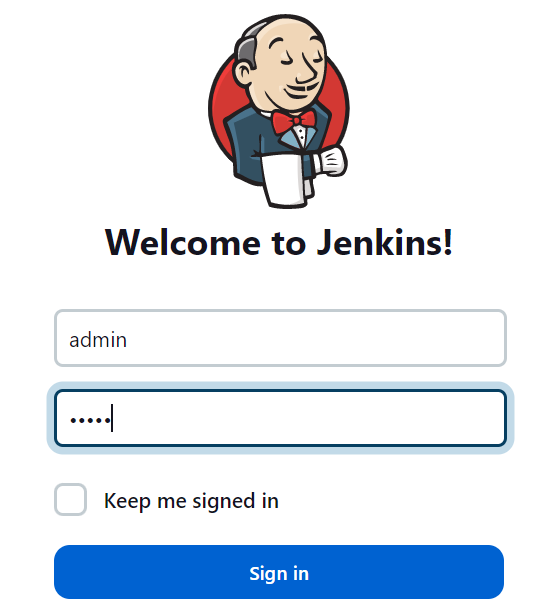

# Sign in to Jenkins

### Click here to [ACCESS JENKINS]({{TRAFFIC_HOST1_8080}}) server

> Required Credentails:

username: `admin`   

password: `admin`

It's also possible to access ports using the top-right navigation in the terminal.
Or we can display the link to that page:

[ACCESS PORTS]({{TRAFFIC_SELECTOR}})

 
