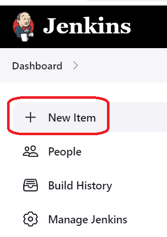
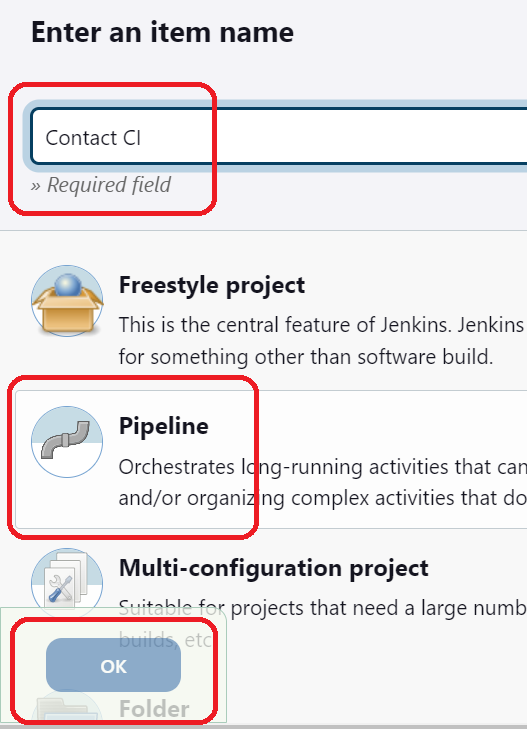
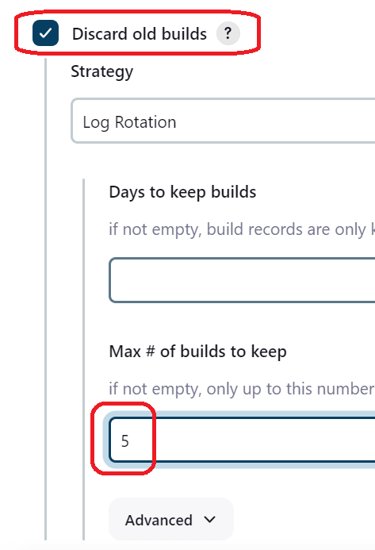
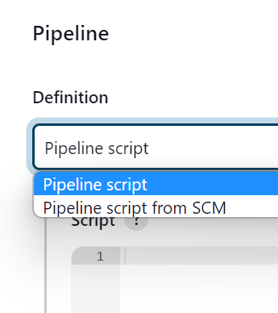
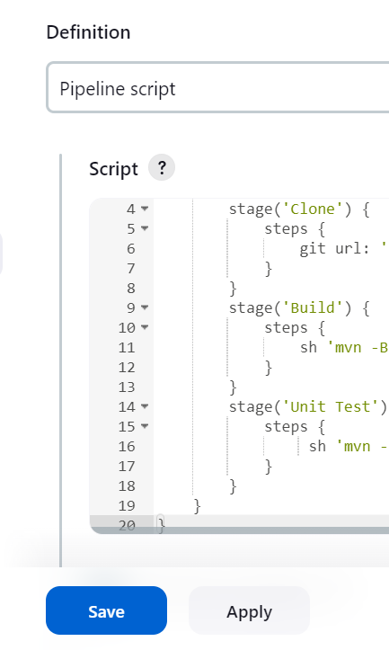
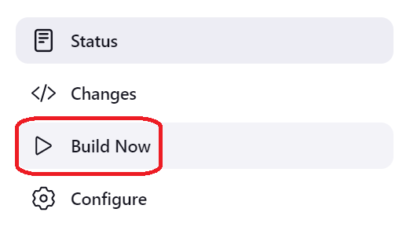
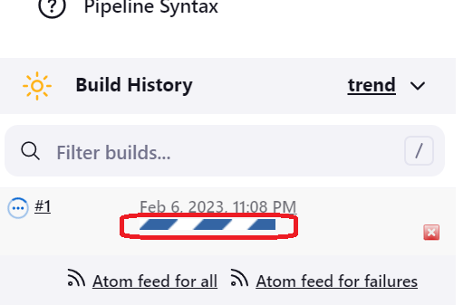
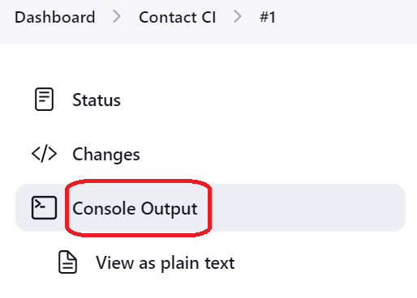
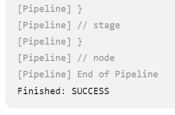

# Create a Jenkins pipeline job

>Click to the **new item** menu on the left side 



>Type new **name** of Job and choose **Pipeline** type



>Choose **Discard old builds**



>For first, choose **Pipeline script** option



>Paste the code into the script window

```
pipeline {
    agent any
    stages {
        stage('Clone') {
            steps {
                git url: '[repository]', branch: 'contact'
            }
        }
        stage('Build') {
            steps {
                sh 'mvn -B -DskipTests package'
            }
        }
        stage('Unit Test') {
            steps {
                 sh 'mvn -B package -DskipTests'
            }
        }
    }
}
```

>Save the Job and check the execution with a manual run





>Click on the task status bar



>Select the **Console Output**



>You should get "Finished: SUCCESS"



<br/>

[repository]: https://github.com/softservedata/lv722.git
