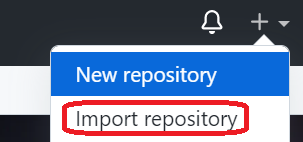
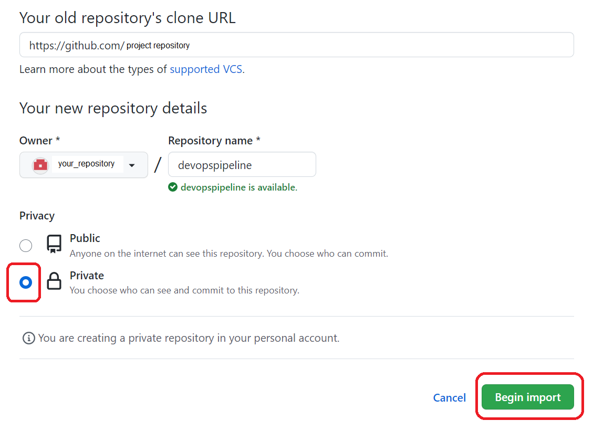

# Clone the project to a private repository

>Import the project from repository 
[repository]
to your new private repository.

>Insert {repository} into the "Your old repository's url" field

 

[repository]: https://github.com/softservedata/lv722.git (https://github.com/softservedata/lv722.git)
