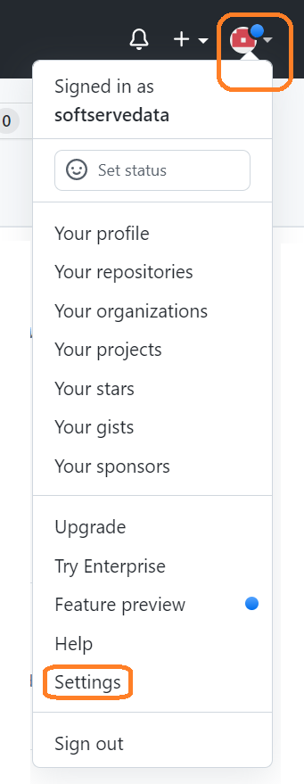
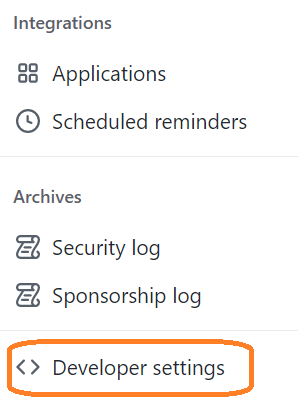
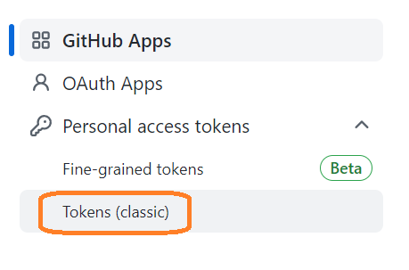
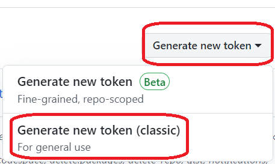
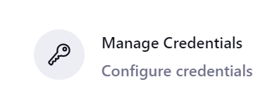
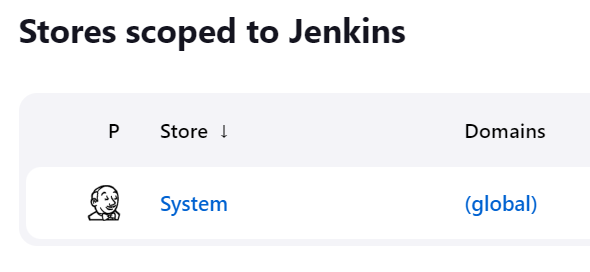
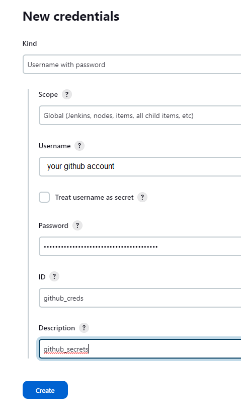

# Add Github credentials to Jenkins

>To create a github token, log in to the github account and go to setting

>Click on the developer setting

>Click on personal access tokens and Generate new token.

>Return to Jenkins, click **Manage Jenkins** and **Manage Credentials**.

>Choose **System** and **Global credentials**

Provide username and github secrets in place of password and then click on the OK button.

 
