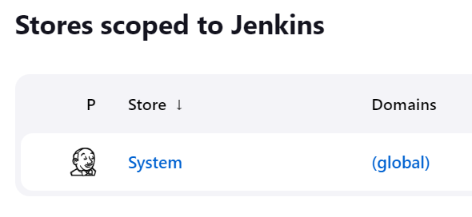
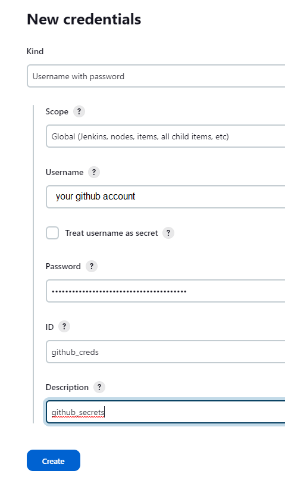

# Add Github credentials to Jenkins

>Return to Jenkins, click **Manage Jenkins** and **Manage Credentials**.

>Choose **System** and **Global credentials**

>Provide username and github secrets in place of password and then click on the **Create** button.

 
