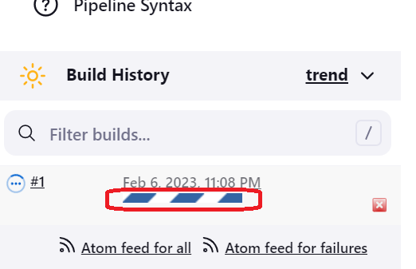
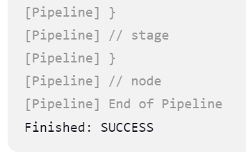

# Update the pipeline script

>Now go to the Jenkins job where you have pasted the code and insert **credentialsId: 'github_creds'**

>Save the Job and check the execution with a manual run

>Click on the task status bar

>Select the **Console Output**

>You should get "Finished: SUCCESS"

 
