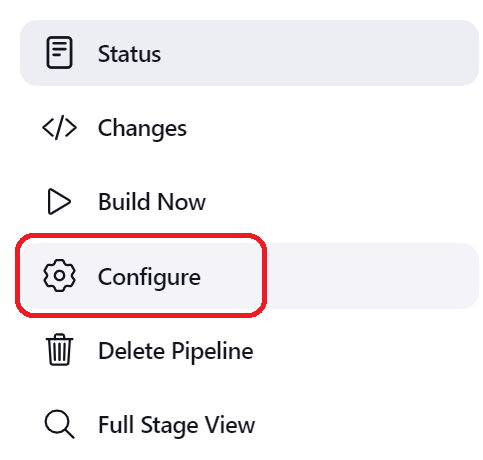
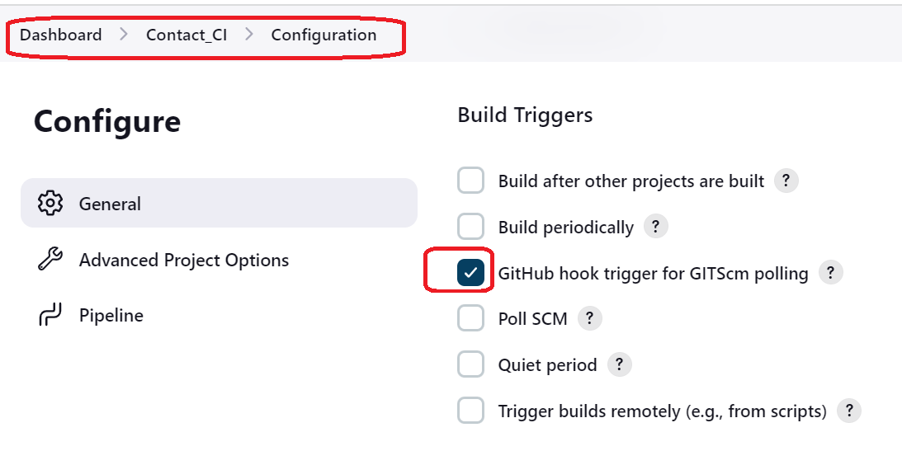

# Setup webhook trigger

>Return to the dashboard and select configure project

>Add a webhook trigger to the script pipeline.

>Go to the project configuration and add **"GitHub hook trigger for GITScm polling"**.

 
