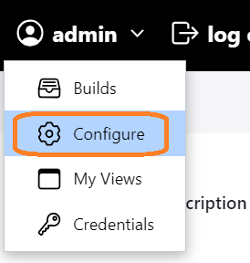
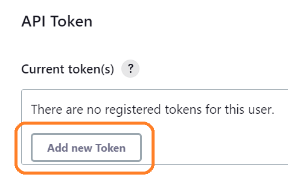

# Generate Jenkins API token

>Click on the Jenkins user profile and select the "Configuration" option.

>Click the "Add new Token" button under the User API Token section.

>Enter a name and generate a new token, e.g

>github_contact
>116b39d8e63d1e458f815433a8d381485a

>Remember the token

 
