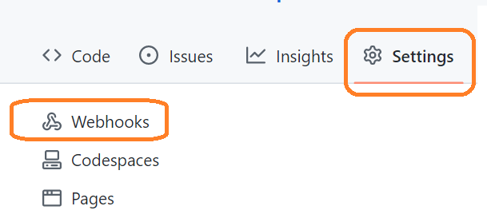
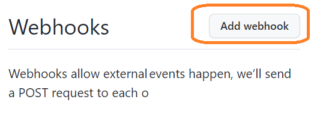
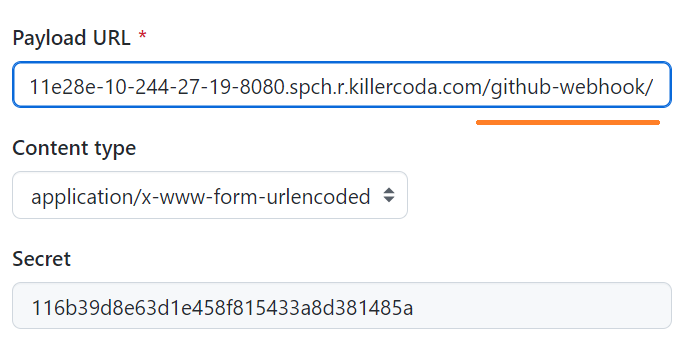

# Setting Github webhooks

>Go to the Webhooks section of the Settings tab in the GitHub menu.

>Click "Add webHook"

>Paste the Jenkins API token as the secret along with the domain name of your Jenkins server and add /github-webhook/ as the URI.

Click "Add webhook" to save setting.

 
