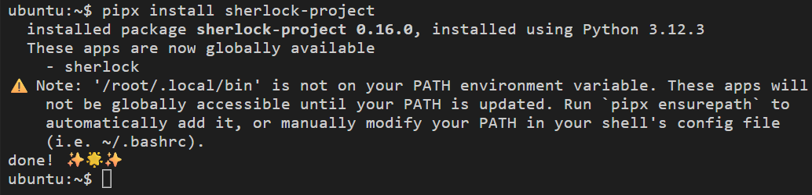
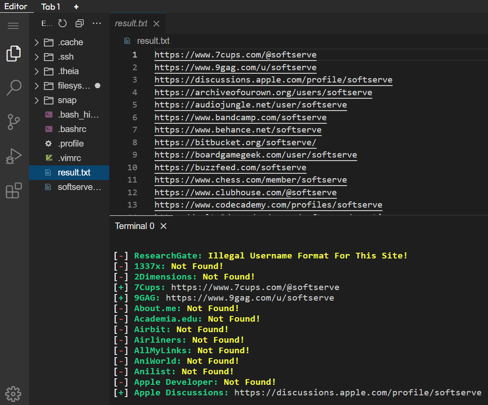
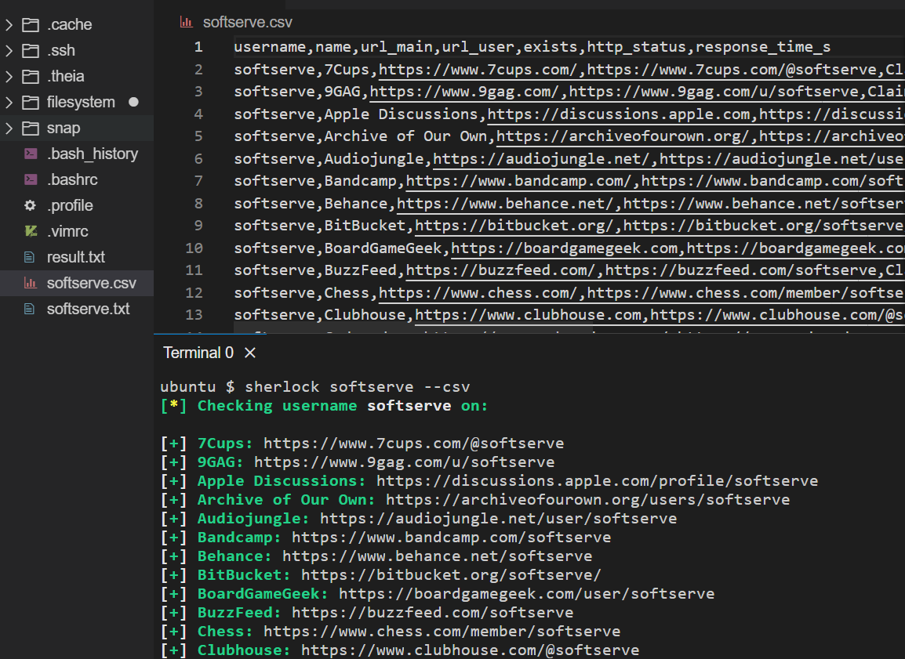

# Sherlock.

Sherlock is a Python program that checks on many social network sites whether a user with the specified name is registered there, whether there is an existing or specific record with such a username (nick). 
Find in social the network of a relative, friend or colleague by name and family is not obtained in all cases, as many users prefer to cover their data with pseudonyms (nicknames).

### Installing Sherlock

* To install, run the following commands
```
cd ~/
pip install sherlock-project
```{{exec}}
<br>



>Community-maintained packages are available for Debian (>= 13), Ubuntu (>= 22.10), Homebrew, Kali, and BlackArch. These packages are not directly supported or maintained by the Sherlock Project.
<br>

### Hunting usernames using sherlock

* Print sites where username was and was not found.
```
sherlock softserve --print-all
```{{exec}}
    Wait a few minutes to see result...
<br>

* Search for a username across 300 sites and save the output to a text file.
```
python3 sherlock softserve -o ~/result.txt
```{{exec}}
    Wait a few minutes and open the file to see result...
<br>

* See result in the console and file.
```
sherlock softserve -o ~/result.txt
sherlock softserve -o ~/result.txt --print-all
```{{exec}}

Wait a few minutes and open the file to see result...
<br>
<br>

* Searching with creating `csv` file.
```
sherlock softserve --csv
```{{exec}}

Wait a few minutes and open the file to see result...
<br>

<br />
