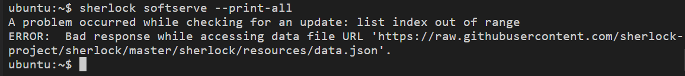
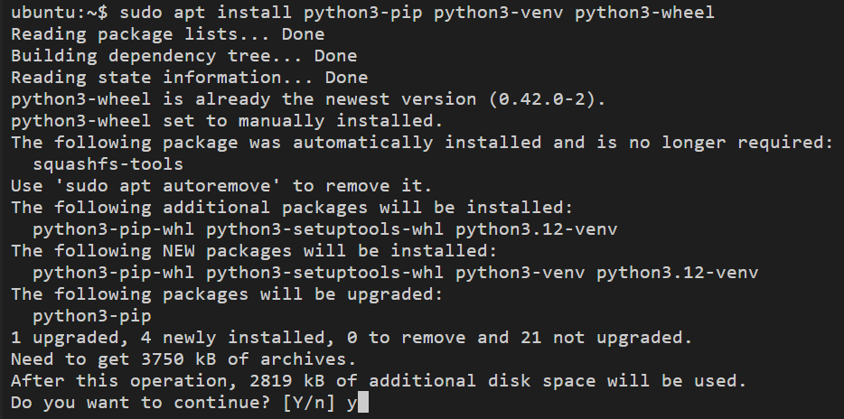
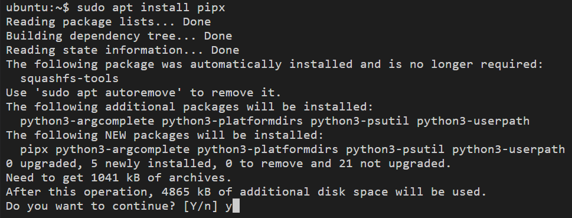
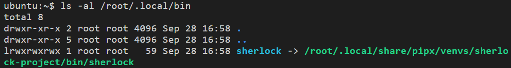
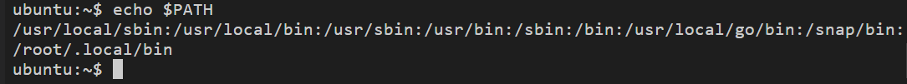
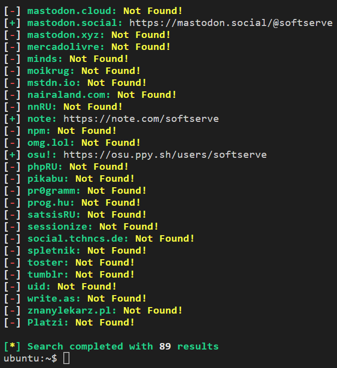
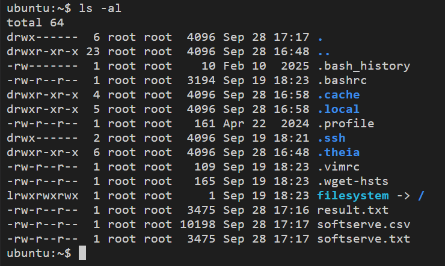

# Sherlock.

Sherlock is a Python program that checks on many social network sites whether a user with the specified name is registered there, whether there is an existing or specific record with such a username (nick). 
Find in social the network of a relative, friend or colleague by name and family is not obtained in all cases, as many users prefer to cover their data with pseudonyms (nicknames).

> NOTE. To install sherlock in Ubuntu and later you can open the terminal and type
```
sudo apt install sherlock
```
> Try running the command
```
sherlock softserve --print-all
```
> If you get this error message: "ERROR: Bad response while accessing data file URL"
```https://raw.githubusercontent.com/
sherlock-project/sherlock/master/
sherlock/resources/data.json```

Please uninstall sherlock
```
sudo apt remove sherlock
```
> and re-install the binary using pipx.
Packages for ParrotOS and Ubuntu 24.04, appear to be broken.


### Installing Sherlock

* Install sherlock via pipx and not the apt package manager.
First, update your local package index with the latest information about available software
```
cd ~/
sudo apt update
```{{exec}}

* To avoid the "Connecting to archive.ubuntu.com" error, install the following Python dependencies
```
sudo apt install python3-pip python3-venv python3-wheel
```{{exec}}



* Than, install pipx, using the following command
```
sudo apt install pipx
```{{exec}}



* Install sherlock via pipx
```
pipx install sherlock-project
```{{exec}}


* Check the existence of the file and its properties
```
ls -al /root/.local/bin
```{{exec}}



* Add the path to the /.local/bin folder.
```
PATH="$PATH:/root/.local/bin"
```{{exec}}

* Check the PATH variable
```
echo $PATH
```{{exec}}




> You can run the command ```pipx ensurepath``` but you need to open a new terminal or re-login for this PATH change to take effect.
<br>

> Community-maintained packages are available for Debian (>= 13), Ubuntu (>= 22.10), Homebrew, Kali, and BlackArch.
These packages are not directly supported or maintained by the Sherlock Project.


### Hunting usernames using sherlock

* Print sites where username was and was not found.
```
sherlock softserve --print-all
```{{exec}}
    Wait a few minutes to see result...



> In case of a server communication error, as a temporary solution, you can use the --local option to get the list of sites from the system like this:
```
sherlock --local softserve
```{{exec}}
    Wait a few minutes to see result...

> However, the local data.json file on your system is only updated when the Sherlock package itself is updated.

* Search for a username across 300 sites and save the output to a text file.
```
sherlock softserve -o ~/result.txt
```{{exec}}
    Wait a few minutes and open the file to see result...
<br>

* See result in the console and file.
```
sherlock softserve -o ~/result.txt --print-all
```{{exec}}

Wait a few minutes and open the file to see result...
<br>
<br>

* Searching with creating `csv` file.
```
sherlock softserve --csv
```{{exec}}

Wait a few minutes and open the file to see result...
<br>

* You can find the files in the profile directory.
```
ls -al
```{{exec}}



<br />
