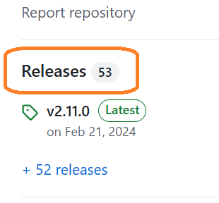
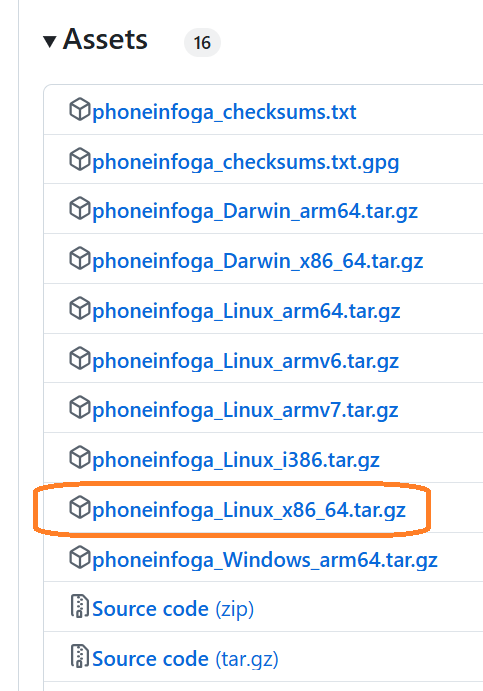
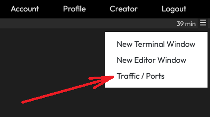
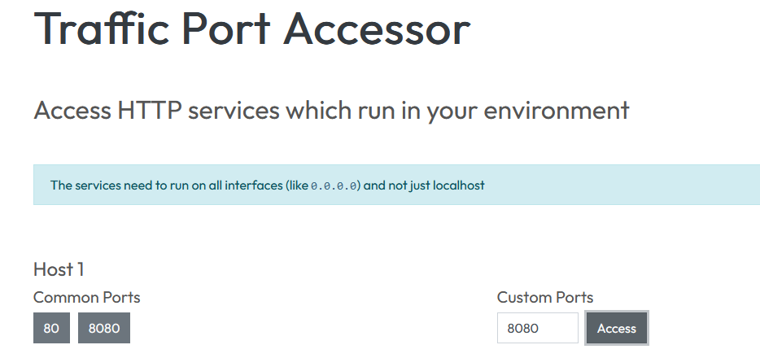
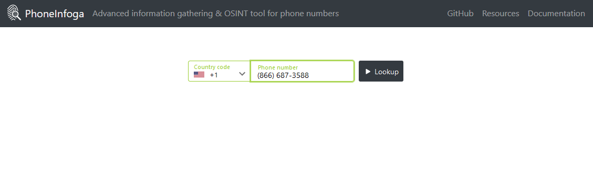
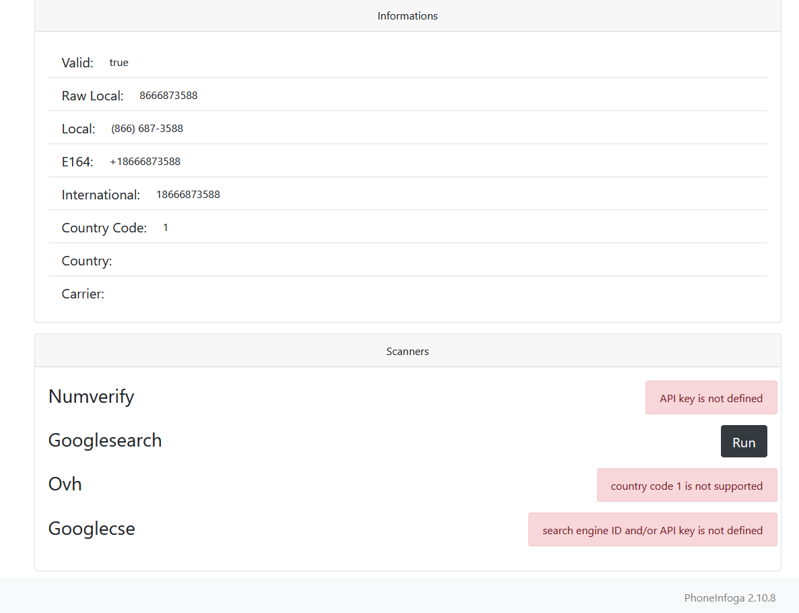
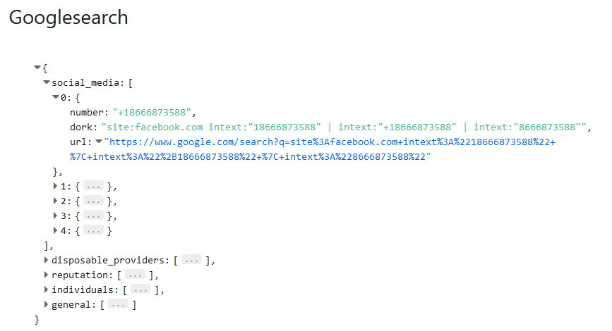

# PhoneInfoga.

PhoneInfoga is an advanced tool to scan international phone numbers. 
It allows you to gather basic information such as country, area, carrier, and line type, then use various techniques to find the VoIP provider or identify the owner. 
It works with a collection of scanners that must be configured for the tool to be effective.

### Installing PhoneInfoga

* For installation PhoneInfoga you should:

Go to site `https://github.com/sundowndev/phoneinfoga`
<br>

Click `Releases`<br>



And download 
`phoneinfoga_Linux_x86_64.tar.gz`<br>



For example, you can use version v2.11.0
```
wget https://github.com/sundowndev/phoneinfoga/releases/download/v2.11.0/phoneinfoga_Linux_x86_64.tar.gz
```{{exec}}
<br>  

>P.S. We have already pre-downloaded the tar archive in the folder `/my_files/PhoneInfoga` for you.
You can copy it to the root folder
```
cp /my_files/PhoneInfoga/phoneinfoga_Linux_x86_64.tar.gz ./
```{{exec}}

* Extract archive using the commands
```
mkdir ~/phoneinfoga
tar -xvf phoneinfoga_Linux_x86_64.tar.gz -C ~/phoneinfoga
cd ~/phoneinfoga
```{{exec}}
<br>

* You can get input parameters
```
./phoneinfoga --help
```{{exec}}
<br>

* Identify the number you want to check.
<br>

* Check the phone number of the softserve in the USA `15125168880`, `18666873588` or in Ukraine `380322409999` `0800608006`.
```
./phoneinfoga scan -n 15125168880
```{{exec}}
```
./phoneinfoga scan -n 380322409999
```{{exec}}
<br>

* The latest version of Phoneinfoga is loaded with the ability to scan phone numbers through a web interface. 
* The web interface can be initiated using the `serve` command.
```
./phoneinfoga serve -p 8080
```{{exec}}
<br>

* After that click:<br>

<br>

* Input port `8080` and click `Access`:<br>

<br>

* In new window tab choice `Country code`, input `Phone number` and click `Lookup` :<br>

<br>

* You can run Googlesearch scanner for more detail information :<br>

<br>


<br>

<br>

<br>
