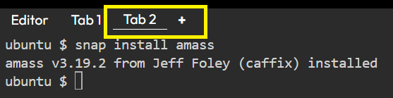

# Amass.

Amass is a command line open-source tool that helps information security professionals to perform network mapping of attack surfaces and perform external asset discovery using open source information gathering and active reconnaissance techniques.
In order to do this, Amass heavily focuses on DNS, HTTP and SSL/TLS data discovering and collecting. 
Amass uses its own internal mechanism and it also integrates perfectly with some external services (SecurityTrails, AlienVault, Shodan etc) to increase the efficiency and power of it's results.

### Installing Amass

* Install amass from source:
```
cd ~/
go install -v github.com/owasp-amass/amass/v4/...@master
```{{exec}}
Wait a few minutes...<br>
__If after 10-15 seconds you don't see the download progress, open a new terminal and type the command there.__<br>
<br>

* Install snap
```
apt install snapd
```{{exec}}
<br>

* And run command:
```
snap install amass
```{{exec}}
<br>


<br>

* Before starting using any tool we should check it's help options.
```
amass -h
```{{exec}}
<br>

__Subcommands:__

In the above help menu we can see that Amass have some options. Let's have a look on to them:<br>
__intel:__ Collect intelligence on the target in order to determine our starting point.<br>
__enum:__ Perform enumeration & mapping of our target to determine possible attacks.<br>
__viz:__ Show the results on a visual formats with analysis and future research.<br>
__track:__ Compare results across enumerations to see changes in their attack surface.<br>
__db:__ Manage the graph databases storing the enumeration results.<br>
__dns:__ Resolve DNS names at high performance.<br>

<br>

* The most basic use of `amass` is `subdomain enumeration`.
```
amass enum -d softserveinc.com
```{{exec}}


```text
    Wait a few minutes...
    Flag -d using to specify our target domain
```
<br>

__Main parameters for subcommand:__

__-v__ - more detailed output;<br>
__-df <STRING>__ — path to a text file containing a list of root domains for analysis;<br>
__-blf <STRING>__ — path to a text file containing a list of subdomains that should be excluded from the analysis scope;<br>
__-nf <STRING>__ - path to a text file containing a list of subdomains about which the penetration tester already has information (a number of search procedures will be skipped for them);<br>
__-ipv4__ — for each detected domain name, show its IPv4 address;<br>
__-src__ - for each detected domain name, show the source from which this information was obtained;<br>
__-oA <STRING>__ - path to save scan results (formats: txt, json);<br>
__-config <STRING>__ — path to the configuration file;<br>
__-active__ — use active scanning (AXFR requests);<br>
__-brute__ — use brute force on subdomains.<br>

<br>

* Passively searching for subdomains and display the data sources where it found each subdomain.
```
amass enum -passive -d softserveinc.com -src
```{{exec}}
<br>

* Searching for information about a specific organization.
```
amass intel -org google
```{{exec}}
    Wait a few minutes...
<br>

* Get Whois data for a specified domain.
```
amass intel -d softserveinc.com -whois
```{{exec}}
    Wait a few minutes...
<br>

Our every scan done with amass is automatically stored on our system that we ran it on.<br>
Then, if we run the same scan again, amass will track any changes that have taken place since your last scan.<br>
The most perfect way to use this feature is to discover which new subdomains have appeared since our last scan.<br>

<br>

* To search for new subdomains run.
```
amass track -d softserveinc.com
```{{exec}}
    Wait a few minutes...
<br>

* Viewing previously performed scans..
```
amass db -show -d softserveinc.com
```{{exec}}
    Wait a few minutes...


__Parameter -names__ will display detected domains or subdomains.

<br>
