# Shodan.

Shodan is a search engine for Internet-connected devices. 
Discover how internet intelligence can help you make better decisions. 
The entire Shodan platform (crawling, IP lookups, searching, and data streaming) is available to developers.

### Installing Shodan

* Install Shodan:
```
cd ~/
pip install shodan
```{{exec}}
    Wait a few minutes...
<br>

* After installation run command.
```
shodan -h
```{{exec}}
<br>

__Command Overview__

__count:__ Returns the number of results for a search query.<br>
__download:__ Search Shodan and download the results into a file where each line is a JSON banner.<br>
__host:__ See information about the host such as where it's located, what ports are open and which organization owns the IP.<br>
__myip:__ Returns your Internet-facing IP address.<br>
__parse:__ Use parse to analyze a file that was generated using the download command.<br>
__search:__ This command lets you search Shodan and view the results in a terminal-friendly way.<br>


Before starting using this tools you should register on website https://www.shodan.io/ and get api_key.<br>


* Go to site https://www.shodan.io/ :<br>
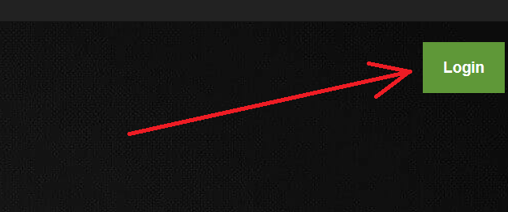<br>
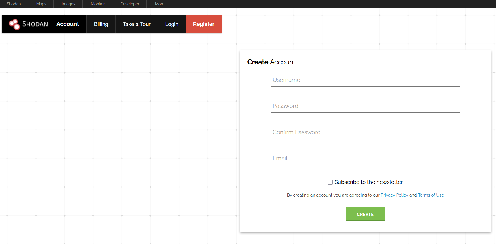<br>
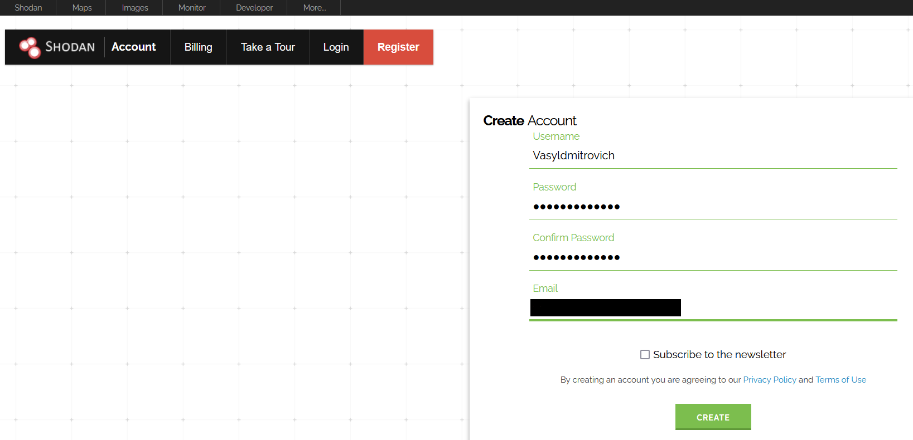<br>
<br>
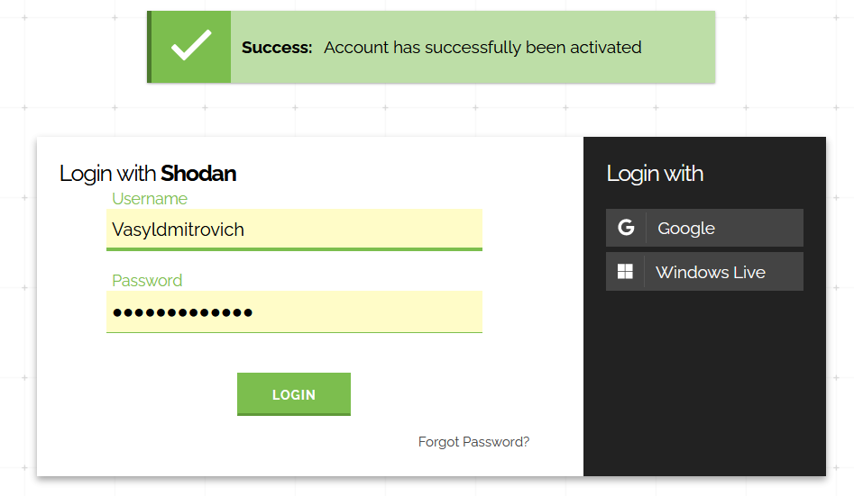<br>
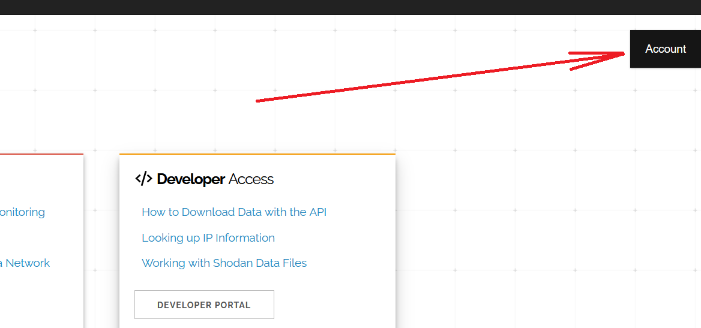<br>
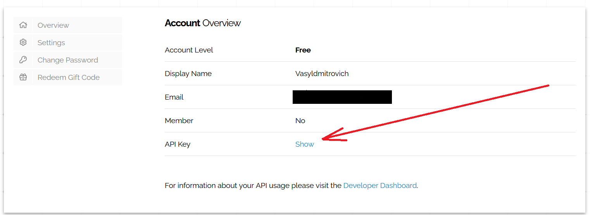<br>
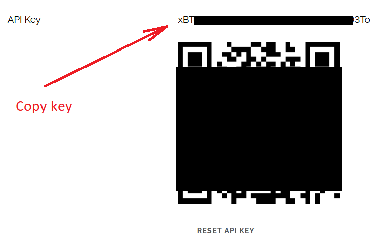<br>
<br>

* Input command __with your api key__:
```text
    shodan init <api_key>
```
<br>

* Print your external ip address.
```
shodan myip
```{{exec}}
<br>

#### We can find information on website or in CLI

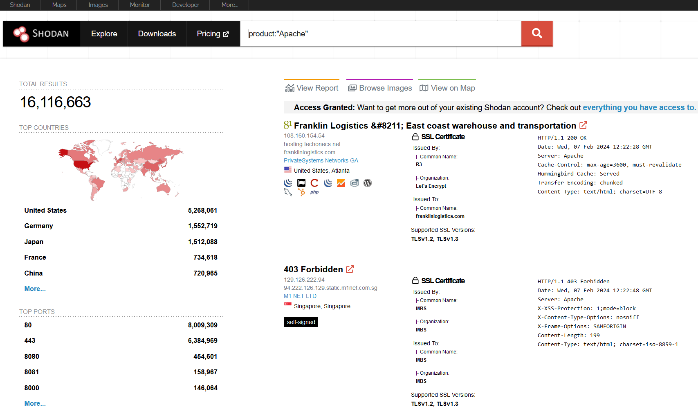<br>

* Return the number of the results for a search.
```
shodan count apache
```{{exec}}
<br>

* On website:
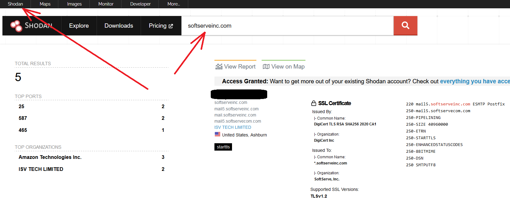<br>
<br>

The number of IPs that you're able to scan is determined by the number of scan credits available on your API plan.
```text
    To see how many scan credits your account has access to either visit your Developer Dashboard or use the Shodan CLI.
    There are 2 types of credits available at Shodan:
        Query credits
        Scan credits
```

apache: search query without any filters and 1st page of results - no query credits used<br>
product:mongodb: searches for MongoDB database servers and uses 1 query credit<br>

<br>

* See how many scan credits you have.
```
shodan info
```{{exec}}
<br>

* Search websites `google.com` that have the word "Apache" in their HTML.

* On website:
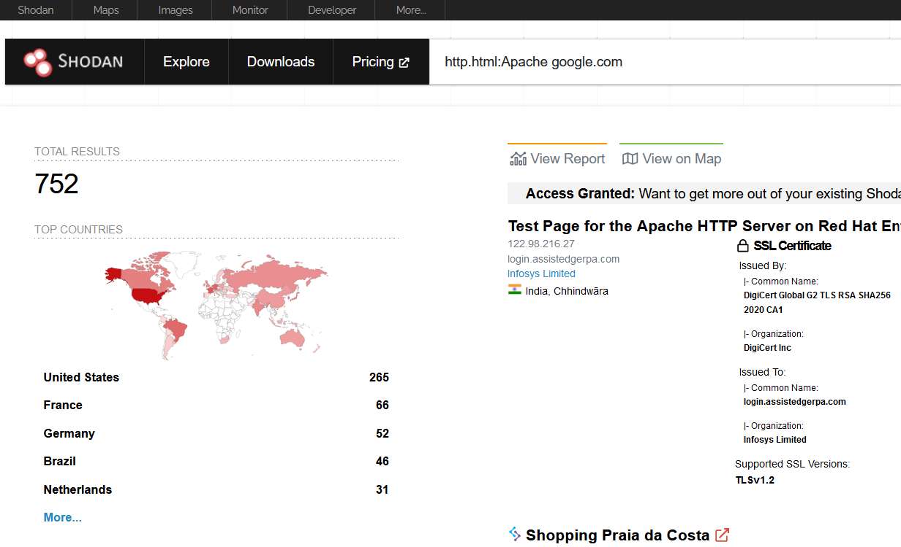<br>

* On CLI:
```
shodan stats http.html:Apache google.com
```{{exec}}
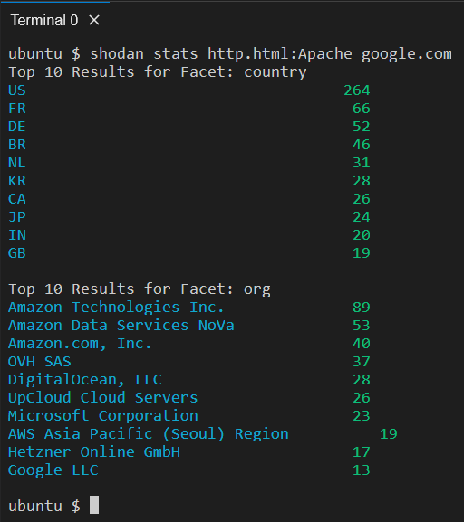<br>
<br>

* __You could find another filters, on page https://www.shodan.io/search/filters .__


For example:
* You can get information from Shodan about the ports used by devices within the specified network rang or on server

* See ip addres of site `softserveinc.com`
```
ping -c 2 softserveinc.com
```{{exec}}
<br>

* Information about the ports used by device __(paste the IP you received)__.
```
shodan stats --facets port net:<change_to_ip>
```{{exec}}
<br>

* Information about the ports used by devices within the specified network range __(paste the IP you received)__.
```
shodan stats --facets port net:<change to ip>/24
```{{exec}}
<br>

### You could use Shodan for:

* Webcam searches
* VOIP communication devices
* Database searches
* Maritime devices
* Files & directories
* Legacy Windows operating systems
* Default / generic credentials etc...

Good luck...
<br>

<br>

