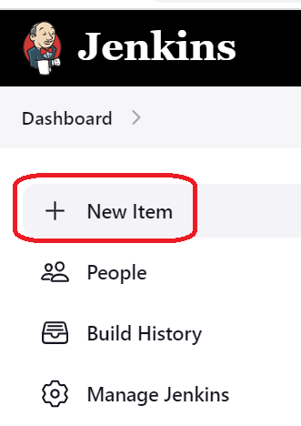
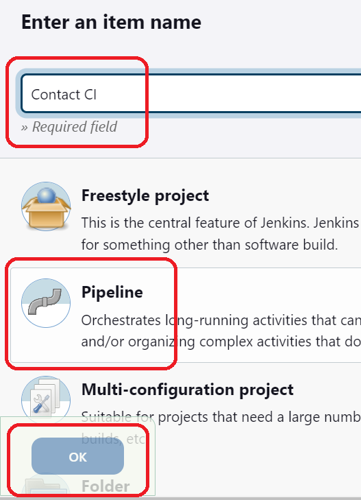
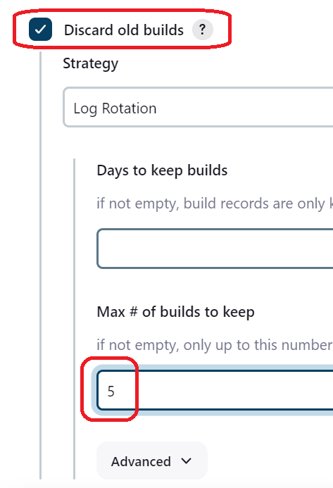
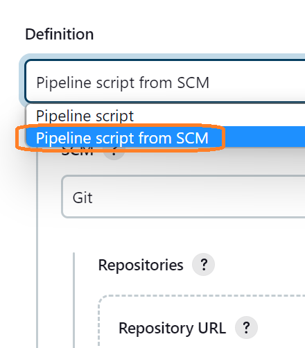
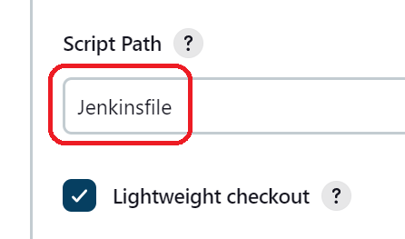
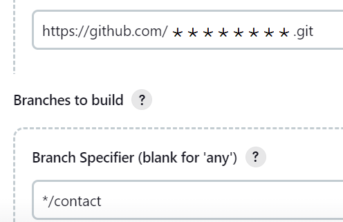

# Create a Jenkins pipeline job

>Click to the **new item** menu on the left side 



>Type new **name** of Job and choose **Pipeline** type



>Click **Discard old builds**



>Select **Pipeline script from SCM** option



>Choose as "Script Path" Jenkinsfile



>Specify the repository and branch 



>Save the Job and use next template for "Jenkinsfile"

```
pipeline {
    agent any
    environment {
      // TODO
    }
    stages {
        stage('Build') {
            steps {
                // TODO
            }
        }
        stage('Unit Test') {
            steps {
                 // TODO
            }
        }
    }
}
```

<br/>

[repository]: https://github.com/softservedata/devopsjen
