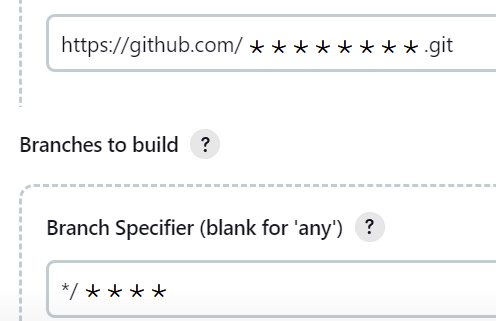

# Create a Jenkins pipeline job

>Click to the **new item** menu on the left side 

>Type new **name** of Job and choose **Pipeline** type

>Click **Discard old builds**

>Select **Pipeline script from SCM** option

>Choose as "Script Path" Jenkinsfile

>Specify the repository and branch 

>Save the Job and develop a Jenkins pipeline solution in your repository

 
