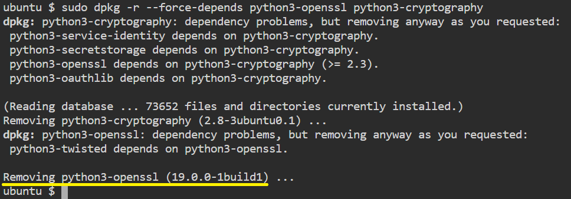
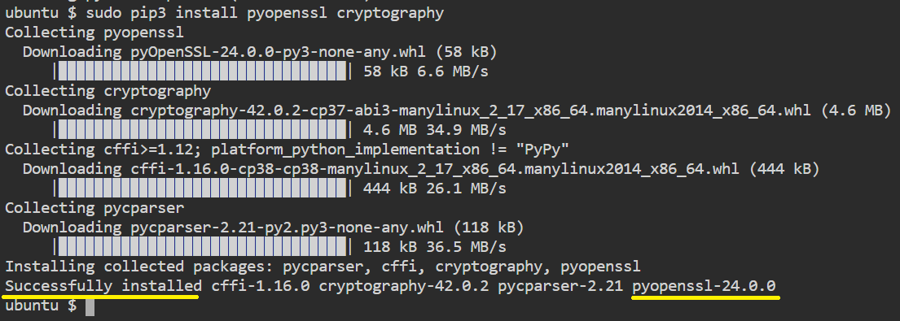
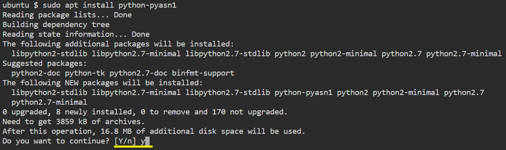

# Update Python dependencies

>Ubuntu come with Python installed by default, but, it are usually not the latest.

>First, let's update some packages.


* python3-openssl is broken on ubuntu, incompatible with python3-cryptography.
Remove these apt packages without removing their dependencies
```
sudo dpkg -r --force-depends python3-openssl python3-cryptography
```{{exec}}

* You should see the following



* Install latest version of these packages into system
```
sudo pip3 install pyopenssl cryptography
```{{exec}}

* You should see the following



* and run
```
sudo apt install -y --fix-missing python3-openssl python3-cryptography
```{{exec}}


* Installing python-pyasn1 package on Ubuntu
```
sudo apt update
```{{exec}}

* and run
```
sudo apt install python-pyasn1
```{{exec}}

* You should see the following




>Now we are ready to install SEToolkit on our system.

<br/>
