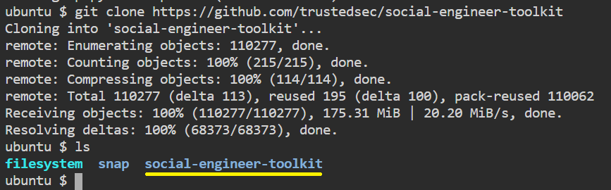
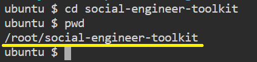
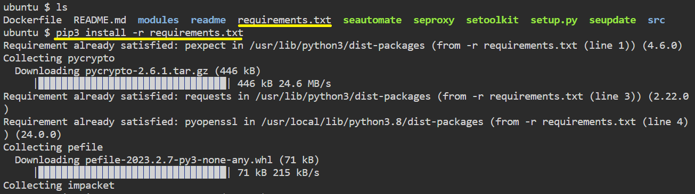
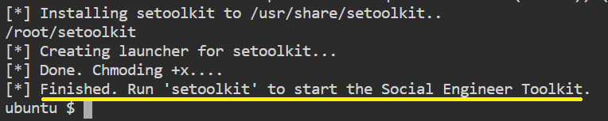
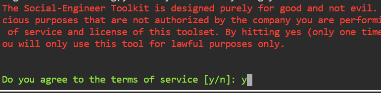
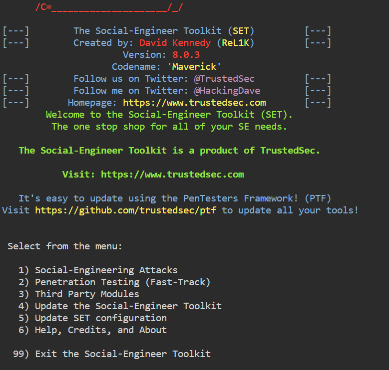

# Installation of the Social Engineering Toolkit

>There are steps that we have to use in order to install the social engineering toolkit.


* We will need to clone SEToolkit from GitHub in order to utilize it
```
git clone https://github.com/trustedsec/social-engineer-toolkit
```{{exec}}

* and run
```
ls
```{{exec}}

* You should see the following



* Now we have successfully downloaded the social engineering toolkit in our directory.
We have to use the following command in order to navigate to the social engineering toolkit's internal directory
```
cd social-engineer-toolkit
```{{exec}}

* and run
```
pwd
```{{exec}}

* You should see the following



* Now we can use the following command to install the requirements
```
sudo pip3 install -r requirements.txt
```{{exec}}

* Requirements installation progress



* All the requirements have been downloaded to our setoolkit.
Now  to install the requirements we have downloaded.
```
sudo python setup.py
```{{exec}}



* Finally all the installation process is complete now it's time to run the Social Engineering Toolkit.
We have to type the following command in order to run the SEToolkit
```
./setoolkit
```{{exec}}

* At this point, setoolkit will ask us (y) or (n).



* When we type y, our social engineering toolkit will start running.



>Now, the SEToolkit has been downloaded on our system.

<br/>
