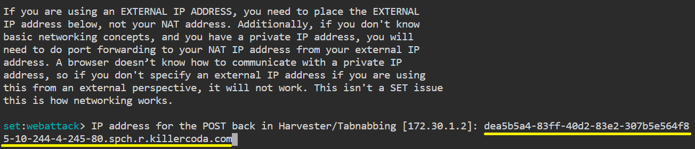

# Setup a Phishing Page

>We can use the Social Engineering Toolkit to perform phishing attacks on our victims.
Using SET, we can create phishing pages for a variety of websites.
SET will generate a link of the option which we have selected, and then we can send that URL to the victim once the victim clicks on that URL and he/she will see a legitimate webpage of a real website that is essentially a phishing page.
Once he/she has entered his/her ID password, we will get that ID password on our terminal screen.

* SEToolkit has been downloaded on our system.

* For first, select the option 1: Social Engineering Attacks.

* After that, we have to select the option 2: Website Attack Vectors.

* Now, we are ready to set up a phishing page.
We'll go with option 3, which is a credential harvester attack method.

* Since we are making a phishing page; we'll go with option 1, which is a web template.

* Click the [link to open the page]({{TRAFFIC_HOST1_80}}) on port 80 and copy the URL address to clipboard

* Right-click in the console and select Paste.

* Usually the IP address do not changed.
However, on our site you need to enter the address from the clipboard and **press enter** to continue.

* The social engineering tool will now create a phishing page on our site.

* Choose option 2 in order to create a Google phishing page, and a phishing page will be generated on our site.

* The social engineering toolkit will design our phishing page.
SEToolkit generate a phishing page of Google on our localhost (i.e., on our IP address). 

> SEToolkit created a Google phishing page on our site (ie our IP address).

 
