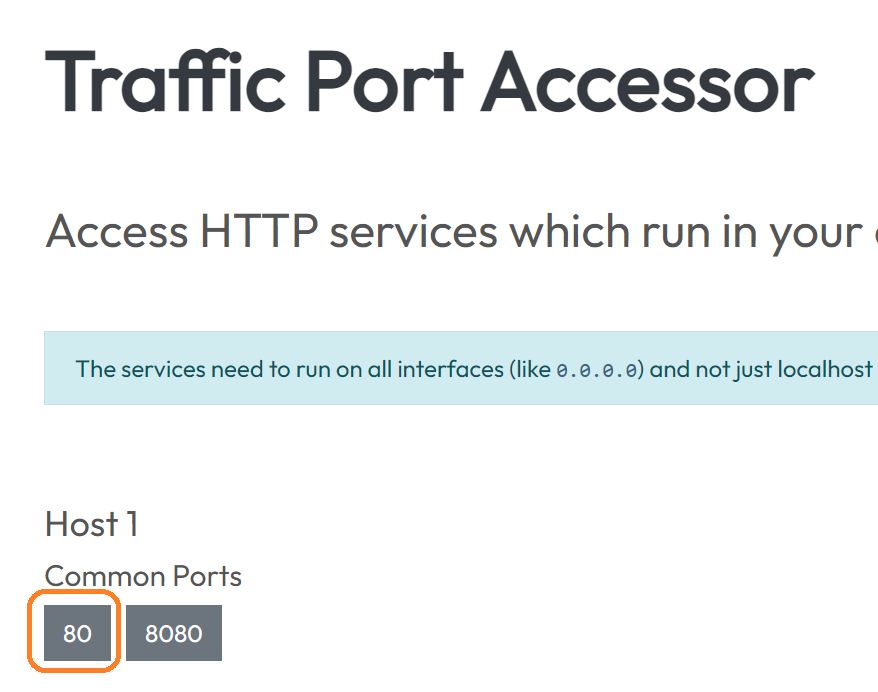
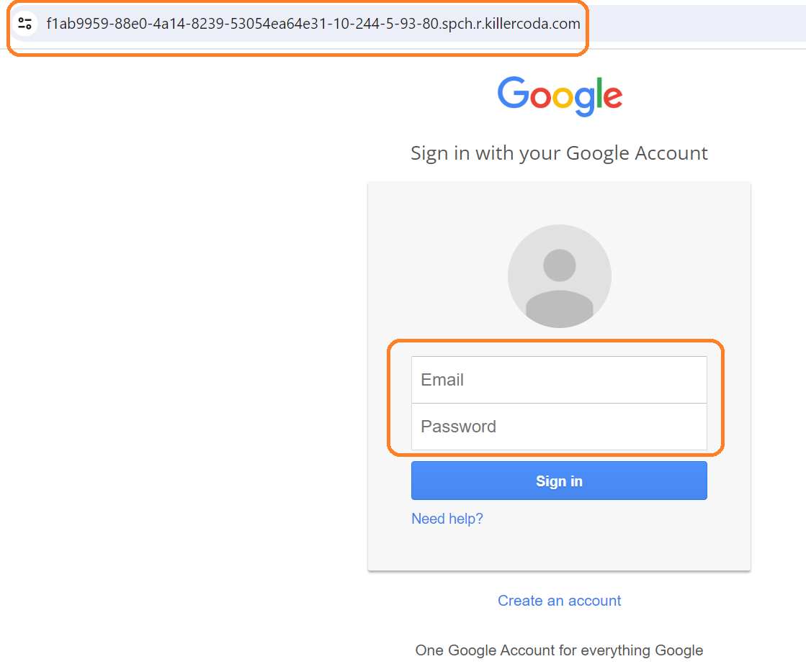
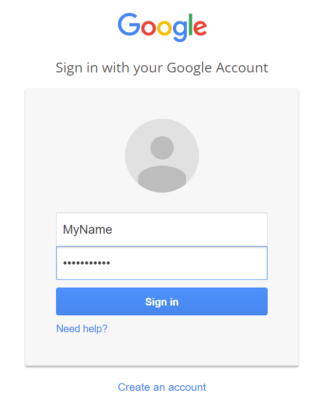
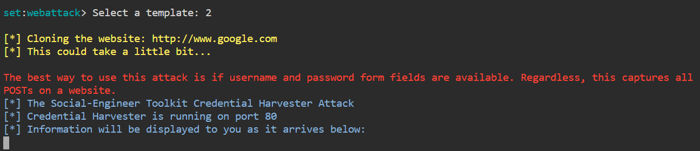

# Checking the Phishing Page

>Web attack has Credential Harvester method that allows us to clone any website for a phishing attack and send the link of that webpage to the victim to get information from user and password fields.

* Open Phishing web page

### Click here to [ACCESS WEB PAGE]({{TRAFFIC_HOST1_80}}) server

It's also possible to access ports using the top-right navigation in the terminal.

Or you can click the link on this page

##[ACCESS PORTS]({{TRAFFIC_SELECTOR}})

* You should see the Phishing page.
Phishing page for Google created using social engineering tools.

* Fill in the fields for login and click Sign in button

* Once the victim types the id password in the fields the id password will be shown on our terminal where SET is running.

>The Social-Engineer Toolkit (SET) is an open-source penetration testing framework which is designed for social engineering.
SET includes several custom attack vectors that enable us to launch a believable attack.

 
