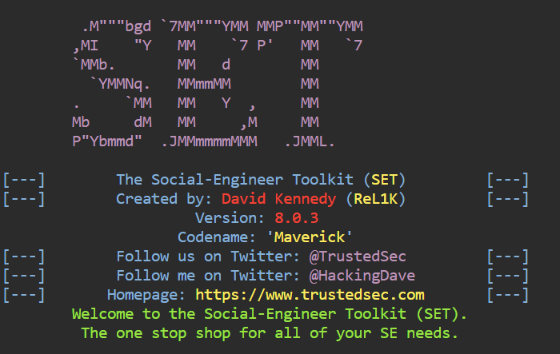
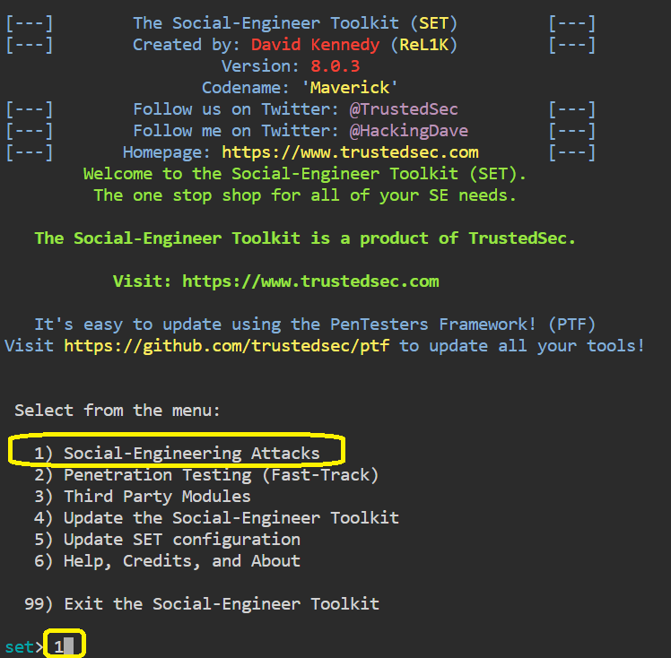
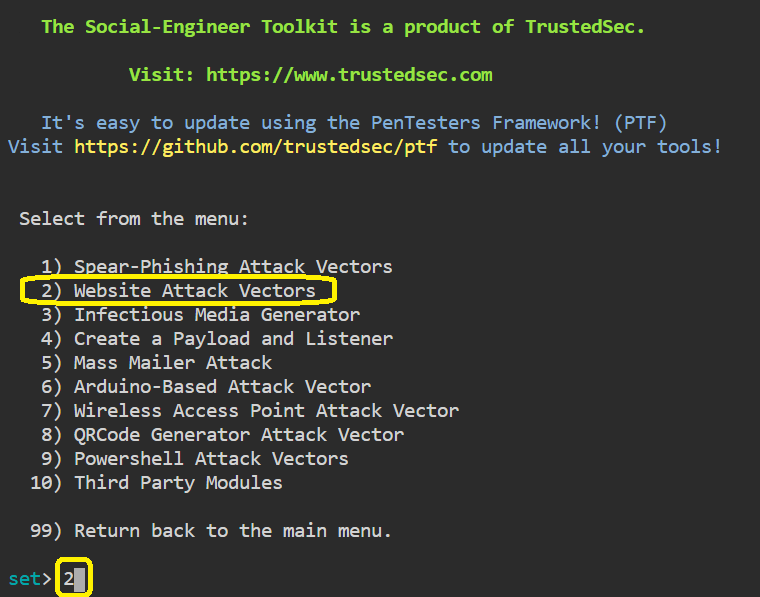

# Setup a Phishing Page

>We can use the Social Engineering Toolkit to perform phishing attacks on our victims.
Using SET, we can create phishing pages for a variety of websites.
SET will generate a link of the option which we have selected, and then we can send that URL to the victim once the victim clicks on that URL and he/she will see a legitimate webpage of a real website that is essentially a phishing page.
Once he/she has entered his/her ID password, we will get that ID password on our terminal screen.

* SEToolkit has been downloaded on our system.

* For first, select the option 1: Social Engineering Attacks.

* After that, we have to select the option 2: Website Attack Vectors.

> Now, we are ready to set up a phishing page.
1. Please, create a phishing page for Salesforce login page (https://login.salesforce.com/?locale=eu) using social engineering tools.
2. Once the victim enters the Username and Password in the fields, the Username and Password should be displayed on our terminal where SET is running.
3. Take a screenshot of the contents of the Username and Password fields.
4. Upload a screenshot on site.

 
