# SonarCloud Configuration. Create Project

> You need to create a new project on SonarCloud.
  We will use maven to build the Java project.
  If you have **already created a project**, go to the next step.

* Click on the "Analyze a new project" button at the bottom of the page.

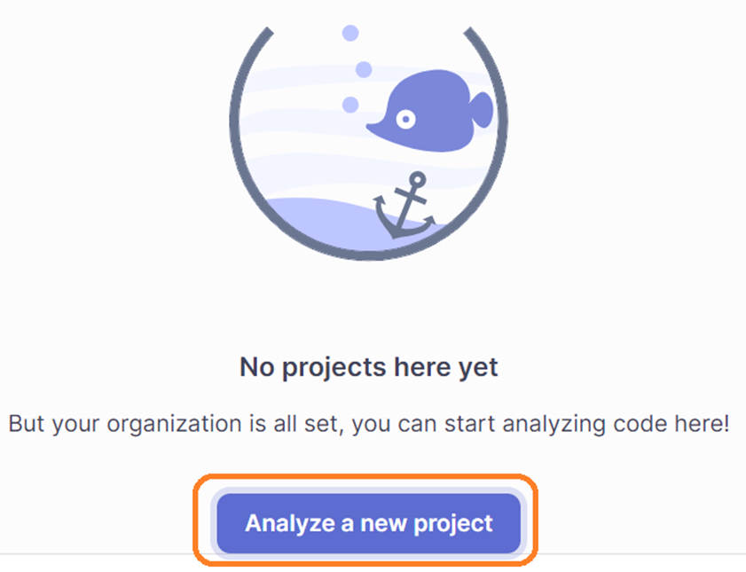

* You can start creating a new project by clicking the "+" button in the upper right corner.

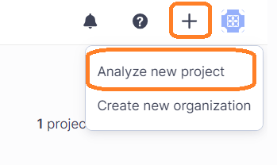

> You can import the project from github or configure it manually.

* Let's create a project manually. Select the organization, type the project name and key.

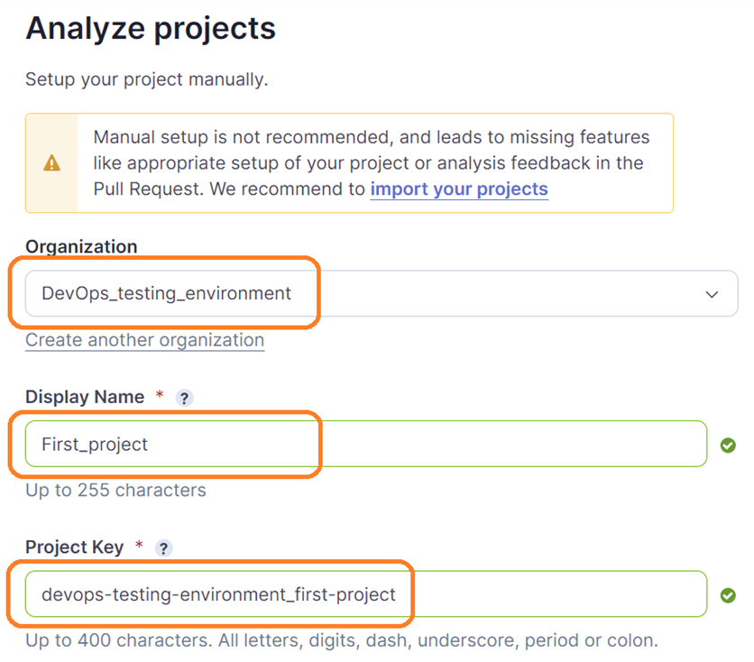

* Fill in the details of the project form, select "Public visibility" and click "Next".

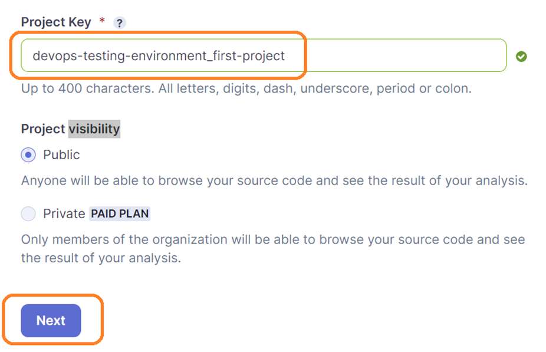

* Set up project for "Clean as You Code".
  Select a "Previous version" and click "Create project" button.
  Any code that has changed since the previous version is considered new code.

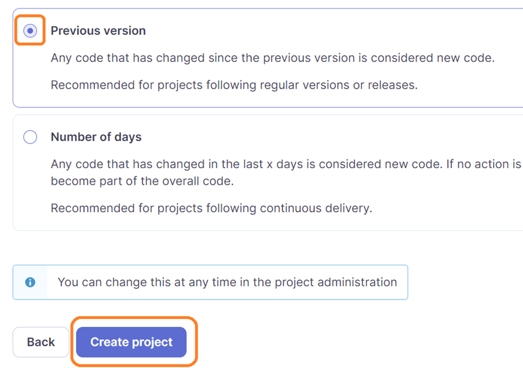

* Choose your Analysis Method. We will use sonarCloud for testing. Therefore, we will choose manual.

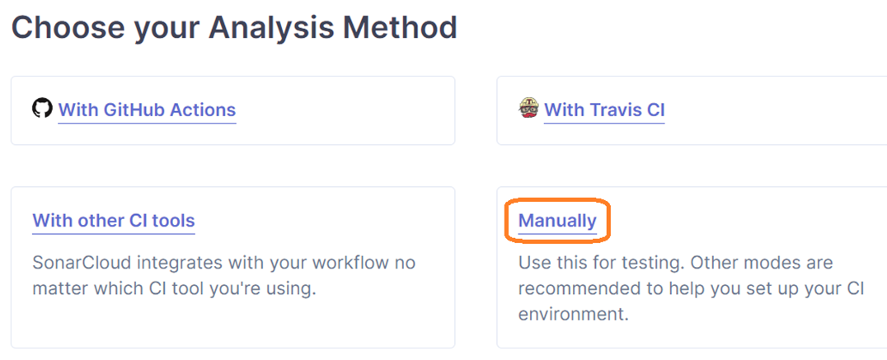

* Please, select an option "maven" as build technology of out project.

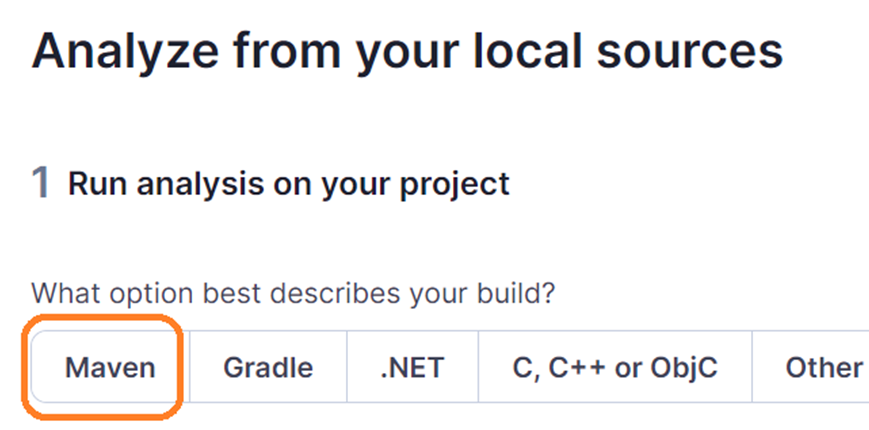

* Once you select maven, SonarCloud will show you the configuration to run sonar with maven.
  You will receive a token. Save it for project configuration.

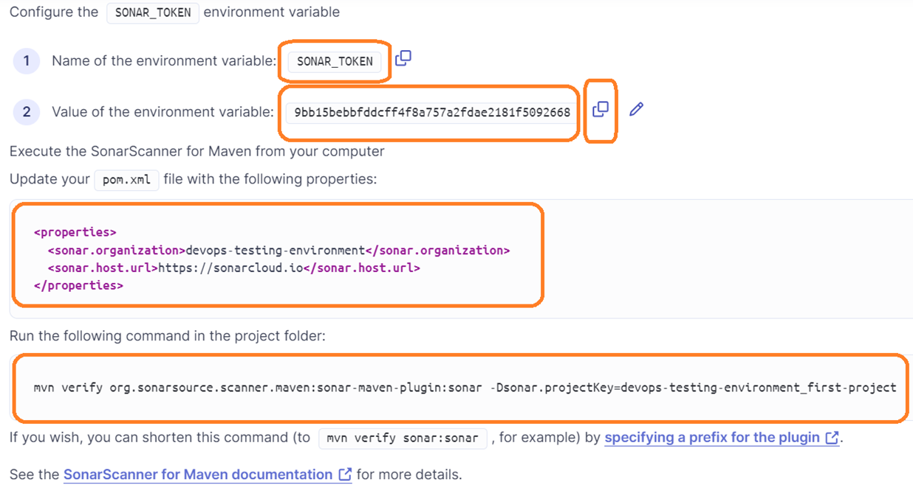

* You should get the following page.

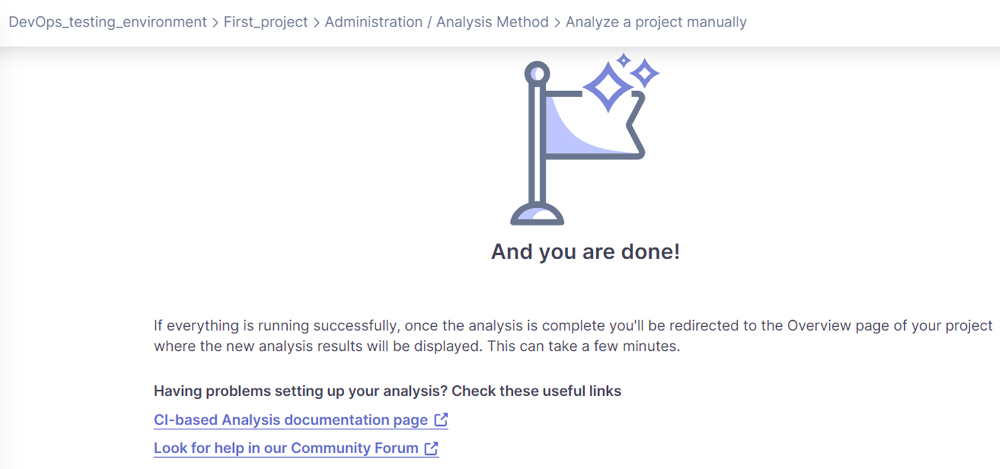

* Click on the link "My projects".

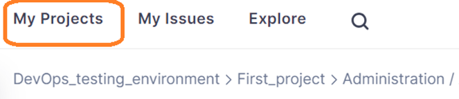

* You should get a list of projects

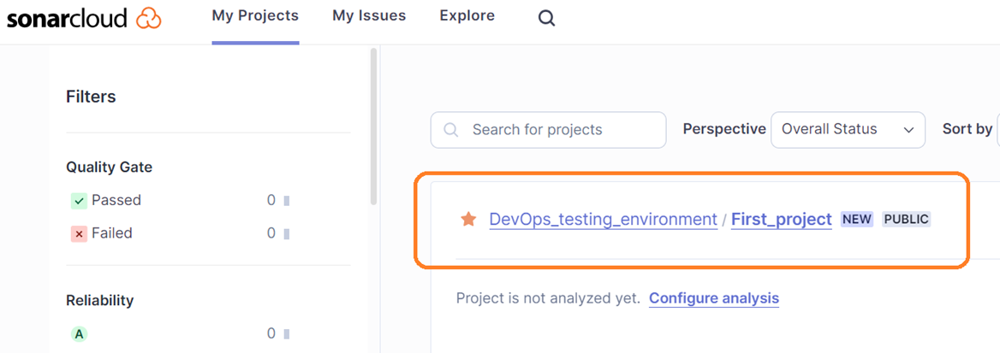

 
