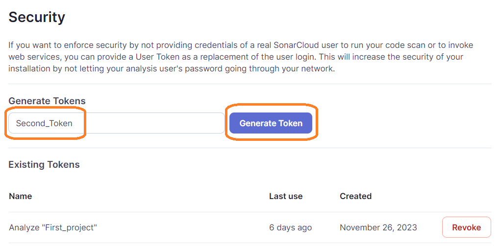

# Configure the SonarCloud API token

> If you do not have a token or it is outdated, you need to generate it.
  If you do not need to **generate a new token**, go to the next step.

* Click on your profile in the top right of the application, click My Account.

* Click on "Security" link.

* Enter a token name and click "Generate Token".

* You should get the following page. Copy the token value.

> After reloading the page, you will not be able to see the token.

 
