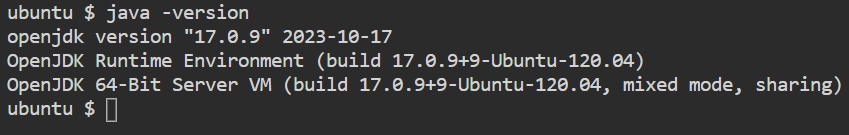
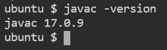
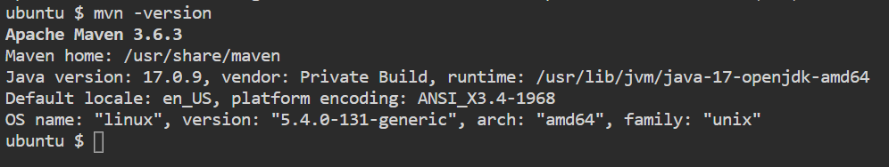
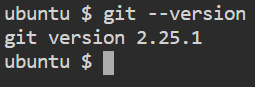

# Establishing project dependencies


> You need to install Java and Maven.

Java is a complex programming system. It includes a programming language and a development platform.
You will be able to run the Java code on any operating system without making any changes.
Java Runtime Environment (JRE) is a Java execution environment.
Java Development Kit (JDK) is an extended JRE. Includes JRE, compiler and other tools.

> Before starting, you have to make sure that all Ubuntu OS packages installed on the server are up to date.

* Update the package index
```
sudo apt update
```{{exec}}

* Ubuntu default repository included Java 17. This is the easiest way to install the JDK using the apt package manager
```
sudo apt -y install openjdk-17-jdk
```{{exec}}

* Once installed, verify the Java Virtual Machine version using the following command
```
java -version
```{{exec}}

* You should get the following output



* Verify the Java compile version using the following command
```
javac -version
```{{exec}}

* You should get the following output




* Install Maven from the official repository
```
sudo apt -y install maven
```{{exec}}

When prompted, type "Y" and press "Enter" to confirm the installation.

* Check the current version of Maven to verify the installation
```
mvn -version
```{{exec}}

* If successful, the output will look like this




* Git client is likely already installed in Ubuntu linux. You can confirm this is the case with the following command:
```
git --version
```{{exec}}

* If you did not get output of a Git version number, you can install it with the Ubuntu default package manager
```
sudo apt -y install git
```{{exec}}

You can confirm that you have installed Git correctly by running the following command and checking that you receive relevant output.
```
git --version
```{{exec}}

* You should get the following page.




<br/>
