# Setup Java application


> You need to Setup Spring Boot Java application.

* First we clone the project from github
```
git clone https://github.com/softservedata/sonarcalc.git
```{{exec}}

* We need to enter the **sonarcalc** directory
```
cd sonarcalc
```{{exec}}

* The Spring-Boot Maven project is configured using a pom.xml file.
  In the pom.xml file, you need to write the properties to communicate with SonarCloud

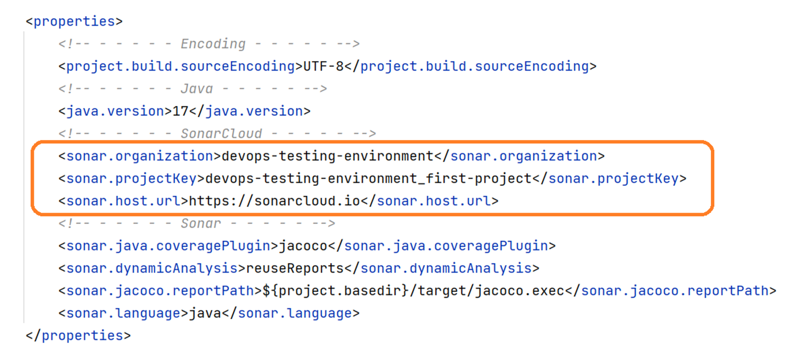

* You should create variables with the following values
`
sonar.host.url=https://sonarcloud.io
sonar.organization=<organization-name created on steps above>
sonar.projectKey=<key created on steps above>
sonar.login=<token generated on steps above>
`

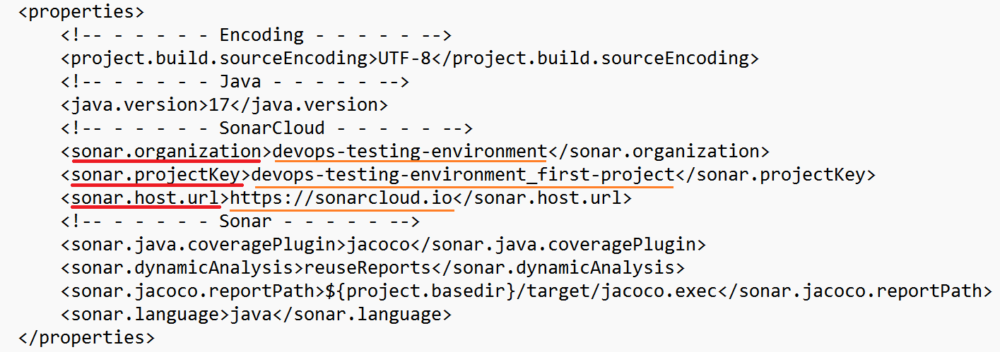

> The **token** cannot be stored in the pom.xml file.

* Update the **pom.xml** file for your organization and project key. Edit file **pom.xml**.
  Click "**i**" to edit `pom.xml` file.
  Click "**Esc**", "**:**" and "**wq**" to save and exit.
```
vi pom.xml
```{{exec}}

> The `sonar-maven-plugin` is recommended as the default scanner for Maven projects.

* The `sonar-maven-plugin` plugin added to the pom.xml file.
  `sonar-maven-plugin` will be executed in the "verify" phase when using the sonar goal.

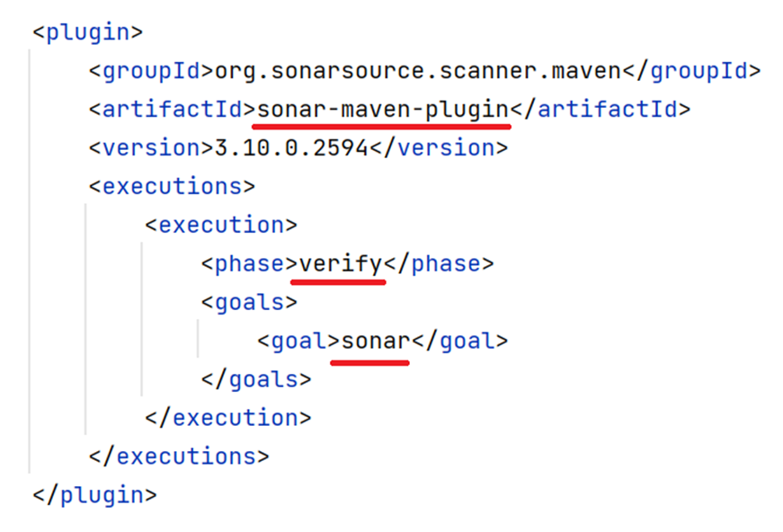

> The `jacoco-maven-plugin` provides access to the JaCoCo runtime agent, which records execution coverage data and creates a code coverage report.

* The `jacoco-maven-plugin` plugin added to the pom.xml file.

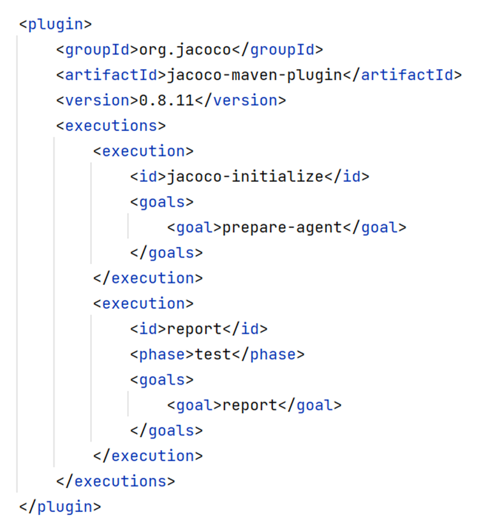

* Run unit tests of the project
```
mvn test
```{{exec}}


* If you received the error "Unable to load cache item" then it was due to maven 3.6.3 being incompatible with jdk17.

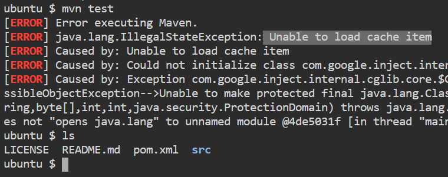

* Remove the outdated version maven
```
sudo apt remove -y maven
```{{exec}}

> You can check for the latest Maven version here https://maven.apache.org/download.cgi

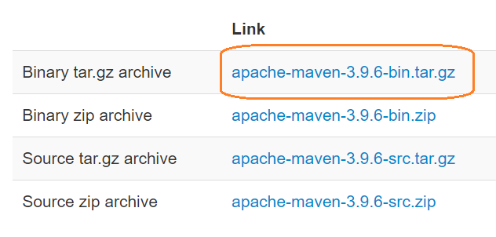

* Download latest Apache Maven.
```
wget https://dlcdn.apache.org/maven/maven-3/3.9.6/binaries/apache-maven-3.9.6-bin.tar.gz
```{{exec}}

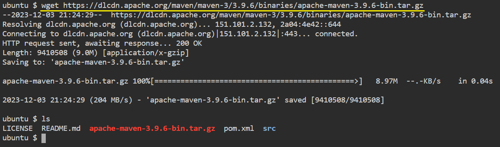

* Unzip it to `/opt` directory
```
sudo tar xf apache-maven-3.9.6-bin.tar.gz -C /opt
```{{exec}}

* Create a sym-link
```
sudo ln -s /opt/apache-maven-3.9.6 /opt/maven
```{{exec}}

* Set up the env
```
export M2_HOME=/opt/maven
export MAVEN_HOME=/opt/maven
export PATH=/opt/maven/bin:$PATH
```{{exec}}

* Now you can verify that it is properly installed
```
mvn -version
```{{exec}}

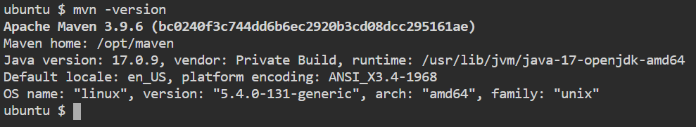


* Repeat the command to run the unit tests of the project
```
mvn test
```{{exec}}

* You should get the following output.

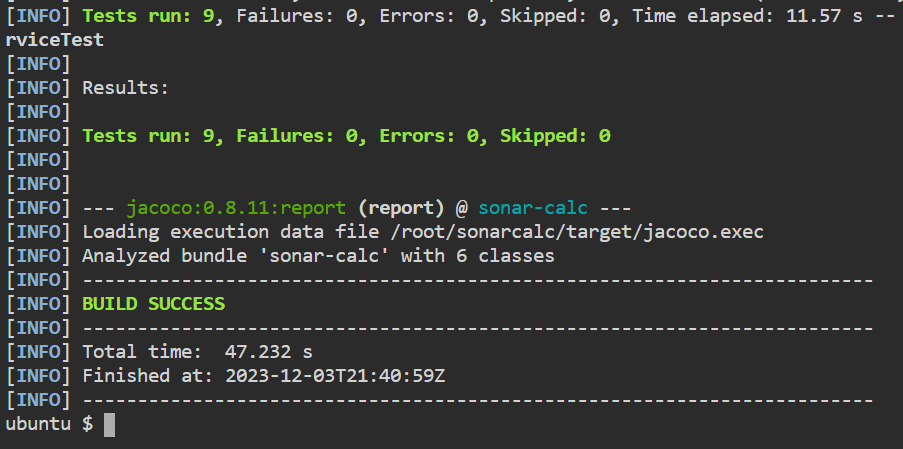

* Run the command to scan project code against the SonarCloud Server.
  Replace **<TOKEN>** with the generated token of your project on SonarCloud.
```
mvn verify sonar:sonar -Dsonar.login=<TOKEN>
```

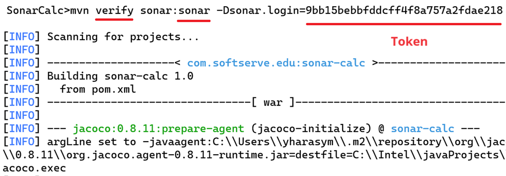

* You should get the following output.

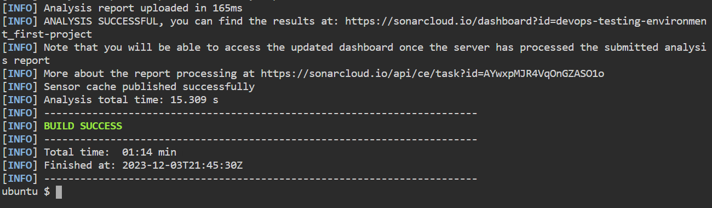


<br/>
