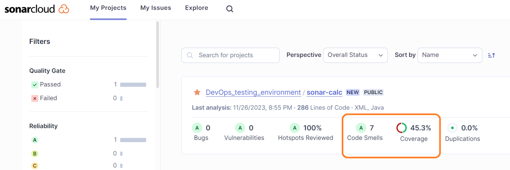

# Analysis the SonarCloud project

> You need to review project on SonarCloud.
  The `sonar-maven-plugin` plugin will transmit locally collected data to the SonarCloud Server.

* The results will be visible to anyone with access to your server

> Code coverage by tests is 45.3%, which is too little.
  The code does not contain vulnerabilities.
  Sonar detected 7 elements of dirty code.

* Click on the project name to go to the details.

* A code smell is a surface indication that usually corresponds to a deeper problem in the system.
  Click on the link next to Code Smells.

* We received a report with links to the code and recommendations for updates.
  The top right corner shows the amount of issues and the average time to update.

* By clicking on the issue, we can see recommendations for updating the code.

 
