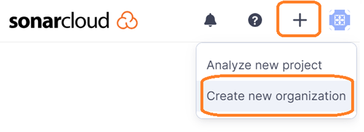
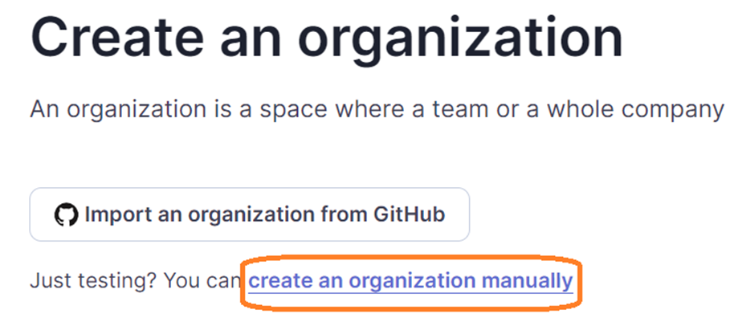
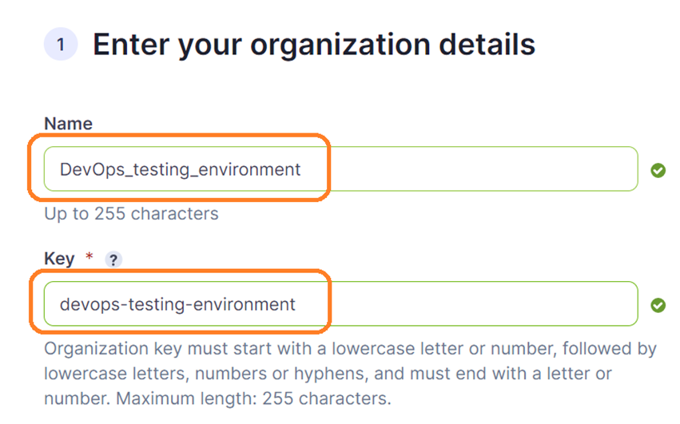
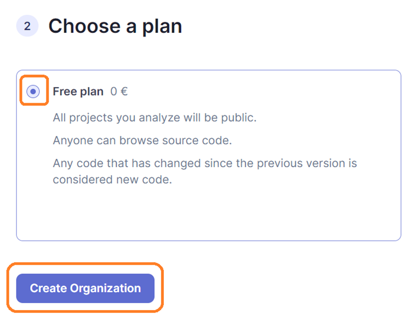
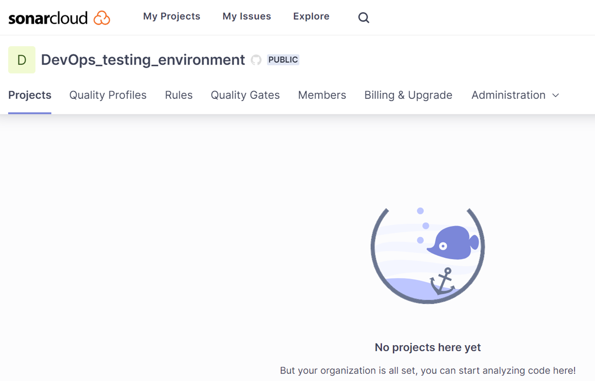

# SonarCloud Configuration. Create Organization

> You need to login and create a new organization on SonarCloud.

* Please open another tab and go to https://sonarclud.io and login.

* Sign in with your GitHub account. If this is your first time, a new account will be created for you.

> If it's your first time logging in or you don't have an organization, please, create a new organization.
  If you have **already created an organization**, go to the next step.

* In the upper right corner, click the "+" icon and select "Create a new organization".

* Let's create an organization manually.

* Fill up the details of form and go to the bottom of the form. You need to enter a unique name and key.

* Select the free plan and click the "Create Organization" button.

* You should get the following page.

 
