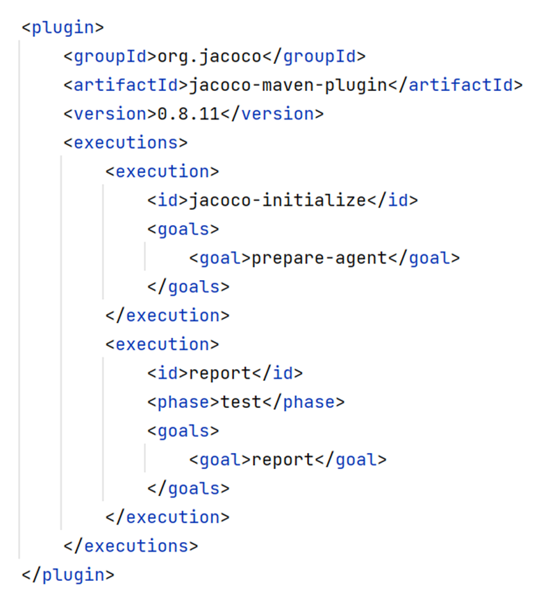
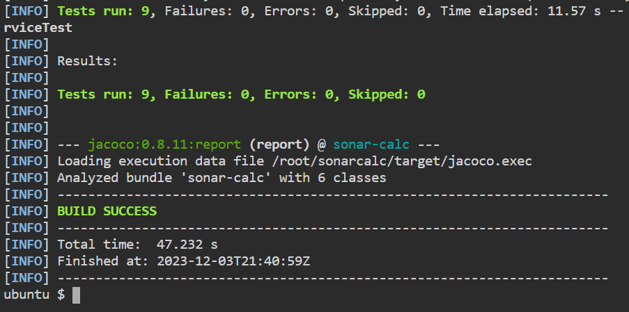

# Setup Java application


> You need to Setup Spring Boot Java application.

* First we clone the project from github
```
git clone https://github.com/softservedata/sonarcalcimmutable.git
```{{exec}}

* We need to enter the **sonarcalc** directory
```
cd sonarcalc immutable
```{{exec}}


> The `sonar-maven-plugin` is recommended as the default scanner for Maven projects.
  However, this plugin is not added to the `pom.xml` file

* The `jacoco-maven-plugin` plugin added to the pom.xml file.




* Run unit tests of the project
```
mvn test
```{{exec}}

* You should get the following output.




<br/>
