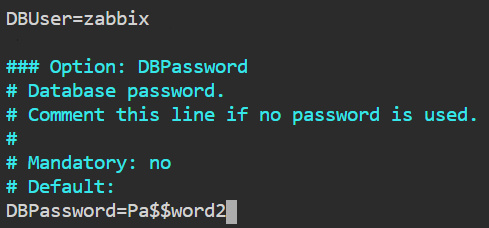
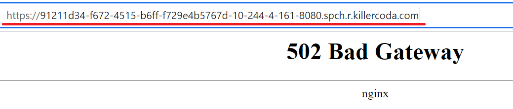
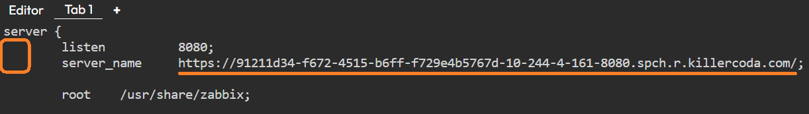
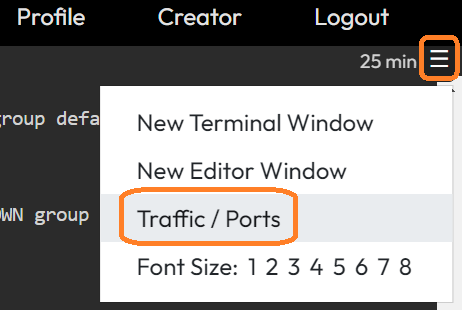
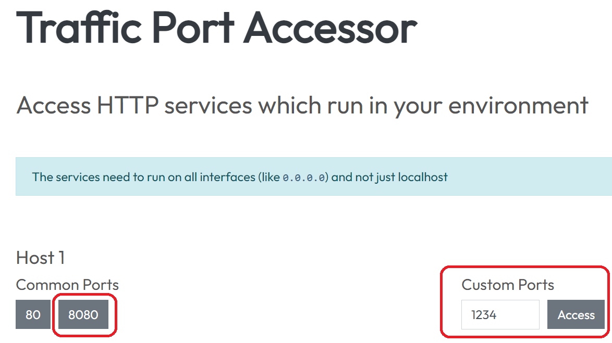
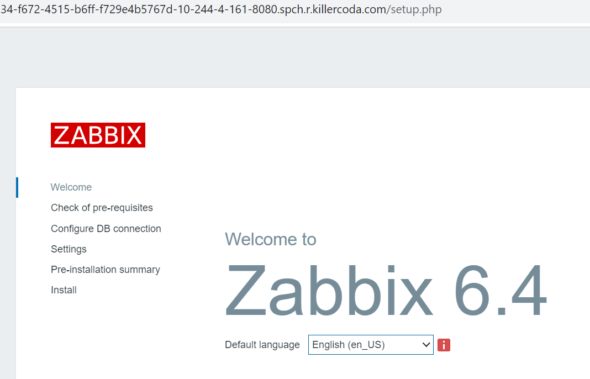

# Install and configure Zabbix


* Install Zabbix repository
```
sudo wget https://repo.zabbix.com/zabbix/6.4/ubuntu/pool/main/z/zabbix-release/zabbix-release_6.4-1+ubuntu20.04_all.deb
```{{exec}}
```
sudo dpkg -i zabbix-release_6.4-1+ubuntu20.04_all.deb
```{{exec}}

* Update the package index too
```
apt update
```{{exec}}

* Install Zabbix server, frontend, agent
```
sudo apt install -y zabbix-server-mysql
```{{exec}}
```
sudo apt install -y zabbix-frontend-php
```{{exec}}
```
sudo apt install -y zabbix-nginx-conf
```{{exec}}
```
sudo apt install -y zabbix-sql-scripts
```{{exec}}
```
sudo apt install -y zabbix-agent
```{{exec}}


* Import initial schema and data. You will be prompted to enter your newly created password: **Pa$$word2**
```
sudo zcat /usr/share/zabbix-sql-scripts/mysql/server.sql.gz | mysql --default-character-set=utf8mb4 -u zabbix -p zabbix
```{{exec}}
>Please wait for the script to complete (2-5 minutes).

* Configure the database for Zabbix server. Edit file **/etc/zabbix/zabbix_server.conf**
```
sudo vi /etc/zabbix/zabbix_server.conf
```{{exec}}



Search '# DBPassword=' line, uncomment and set up, click "i" to edit 
```
DBPassword=Pa$$word2
```
Click "Esc", ":" and "wq" to save and exit

* Click the [link to open the page]({{TRAFFIC_HOST1_8080}}) on port 8080 and copy the URL address to clipboard



* Configure PHP for Zabbix frontend. Edit file **/etc/zabbix/nginx.conf**
```
sudo vi /etc/zabbix/nginx.conf
```{{exec}}

Uncomment and set 'listen' and 'server_name' directives.
```
listen 8080;
server_name example.com;
```



* Restart PHP-FPM to apply new settings
```
sudo systemctl restart php7.4-fpm
```{{exec}}

* Start Zabbix server and agent processes and make it start at system boot.
```
sudo systemctl restart zabbix-server
```{{exec}}
```
sudo systemctl restart zabbix-agent
```{{exec}}
```
sudo systemctl restart nginx
```{{exec}}


* Open Zabbix UI web page

##### Click here to [ACCESS ZABBIX]({{TRAFFIC_HOST1_8080}}) server

It's also possible to access ports using the top-right navigation in the terminal.



Or you can click the link to that page



[ACCESS PORTS]({{TRAFFIC_SELECTOR}})

You should see the Zabbix start page



<br/>
