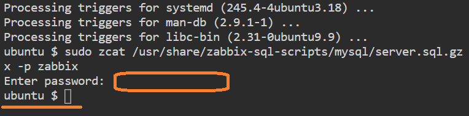
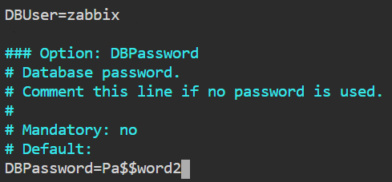
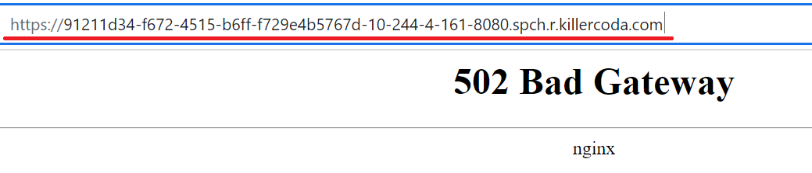
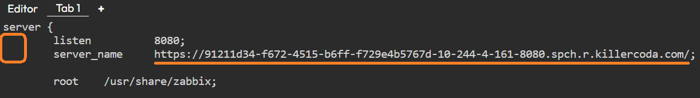
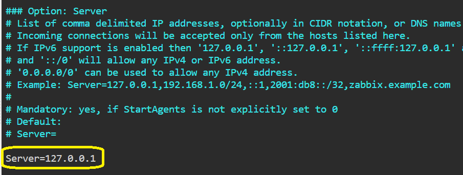
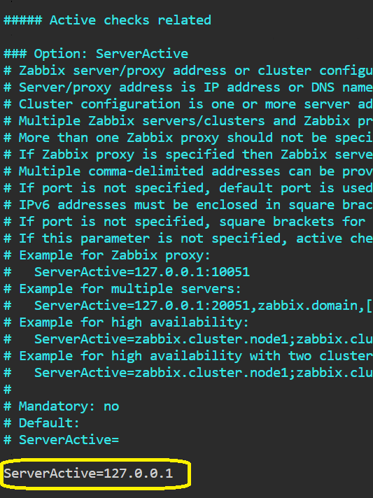
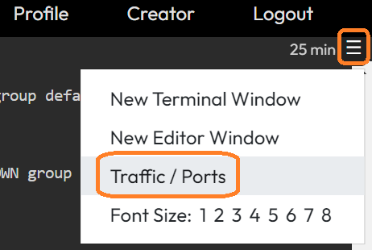
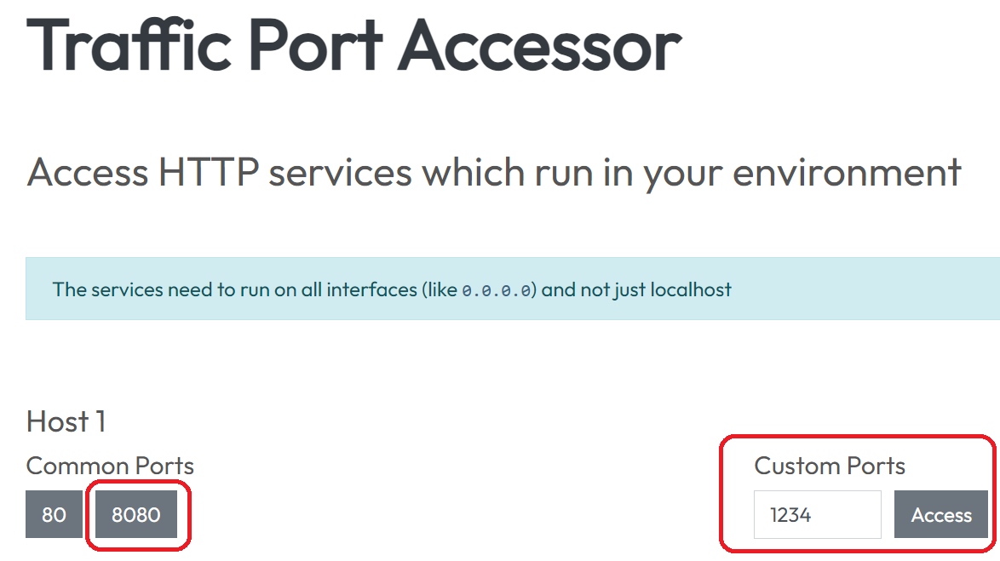
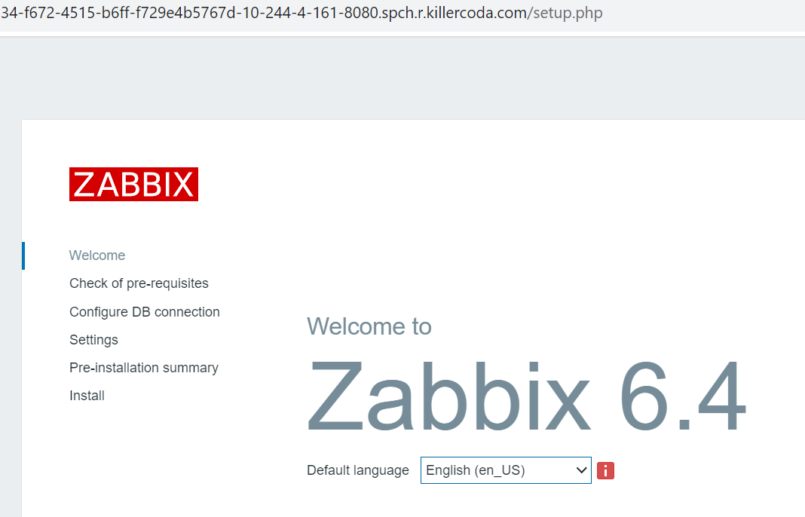

# Install and configure Zabbix


* Install Zabbix repository
```
sudo wget https://repo.zabbix.com/zabbix/6.4/ubuntu/pool/main/z/zabbix-release/zabbix-release_6.4-1+ubuntu20.04_all.deb
```{{exec}}
```
sudo dpkg -i zabbix-release_6.4-1+ubuntu20.04_all.deb
```{{exec}}

* Update the package index too
```
apt update
```{{exec}}

* Install Zabbix server, frontend, agent
```
sudo apt install -y zabbix-server-mysql
```{{exec}}
```
sudo apt install -y zabbix-frontend-php
```{{exec}}
```
sudo apt install -y zabbix-nginx-conf
```{{exec}}
```
sudo apt install -y zabbix-sql-scripts
```{{exec}}
```
sudo apt install -y zabbix-agent
```{{exec}}


* Import initial schema and data. You will be prompted to enter your newly created password: **Pa$$word2**
```
sudo zcat /usr/share/zabbix-sql-scripts/mysql/server.sql.gz | mysql --default-character-set=utf8mb4 -u zabbix -p zabbix
```{{exec}}
> Please wait for the script to complete (2-5 minutes).



* Configure the database for Zabbix server. Edit file **/etc/zabbix/zabbix_server.conf**
```
sudo vi /etc/zabbix/zabbix_server.conf
```{{exec}}



Search '# DBPassword=' line, uncomment and set up, click "**i**" to edit 
```
DBPassword=Pa$$word2
```
Click "**Esc**", "**:**" and "**wq**" to save and exit

* Click the [link to open the page]({{TRAFFIC_HOST1_8080}}) on port 8080 and copy the URL address to clipboard



* Configure PHP for Zabbix frontend. Edit file **/etc/zabbix/nginx.conf**
```
sudo vi /etc/zabbix/nginx.conf
```{{exec}}

Uncomment and set 'listen' and 'server_name' directives.
```
listen 8080;
server_name example.com;
```



Click "**Esc**", "**:**" and "**wq**" to save and exit


* Configure Zabbix agent. Edit file **/etc/zabbix/zabbix_agentd.conf**
```
sudo vi /etc/zabbix/zabbix_agentd.conf
```{{exec}}

Change the IP address of your Zabbix server.
For this example, leave the value at 127.0.0.1




> By default, the Zabbix server connects to the agent. But for some checks (for example, for monitoring logs) a reverse connection is required. For correct operation, you need to specify the address of the Zabbix server and the unique name of the host.

Find the section that configures active checks and update "ServerActive" value.
For this example, leave the value at 127.0.0.1



Save and close the file.

Click "**Esc**", "**:**" and "**wq**" to save and exit

* The agent will listen on port 10050 to connect to the server. Setup a UFW to allow connections to this port
```
sudo ufw allow 10050/tcp
```{{exec}}


* Restart PHP-FPM to apply new settings
```
sudo systemctl restart php7.4-fpm
```{{exec}}

* Restart Zabbix server and agent processes and make it start at system boot.
```
sudo systemctl restart zabbix-server
```{{exec}}
```
sudo systemctl restart zabbix-agent
```{{exec}}
```
sudo systemctl restart nginx
```{{exec}}

* Check if the Zabbix agent is working correctly
```
sudo systemctl status zabbix-agent
```{{exec}}

> The agent is ready to send data to the Zabbix server. But to use it, you need to connect to it from the server's web console.


* Open Zabbix UI web page

##### Click here to [ACCESS ZABBIX]({{TRAFFIC_HOST1_8080}}) server

It's also possible to access ports using the top-right navigation in the terminal.



Or you can click the link to that page



[ACCESS PORTS]({{TRAFFIC_SELECTOR}})

You should see the Zabbix start page



<br/>
