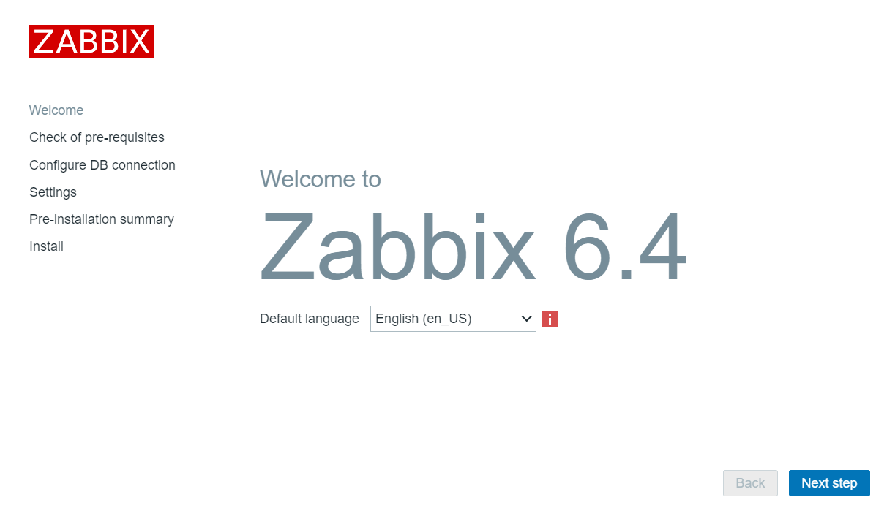
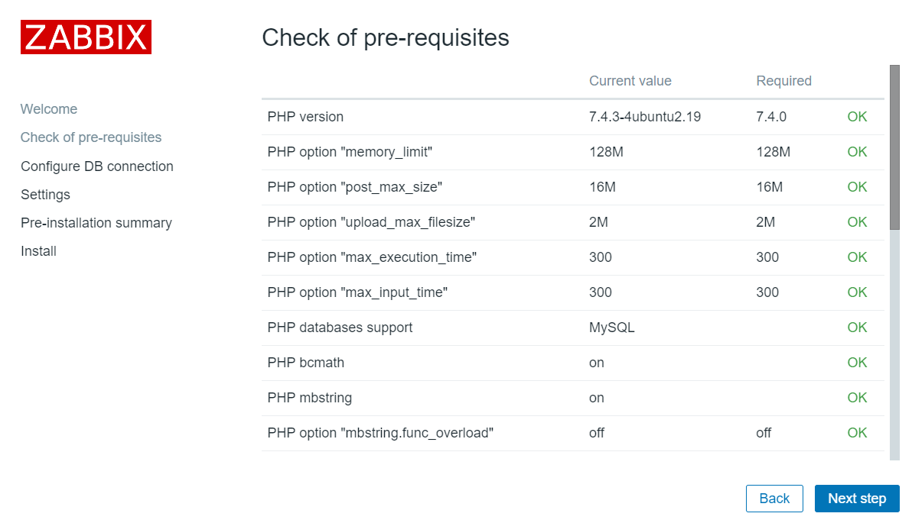
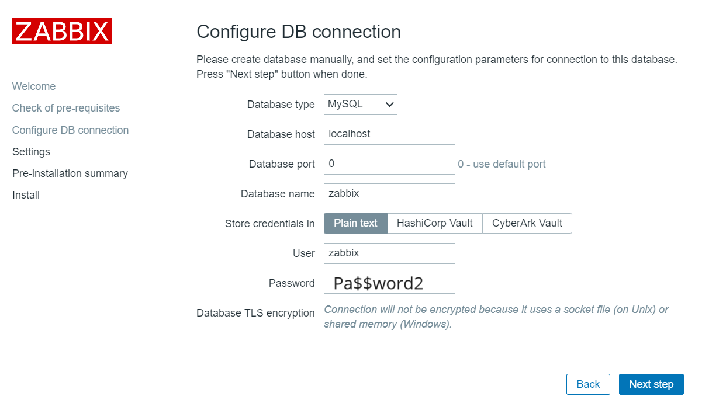
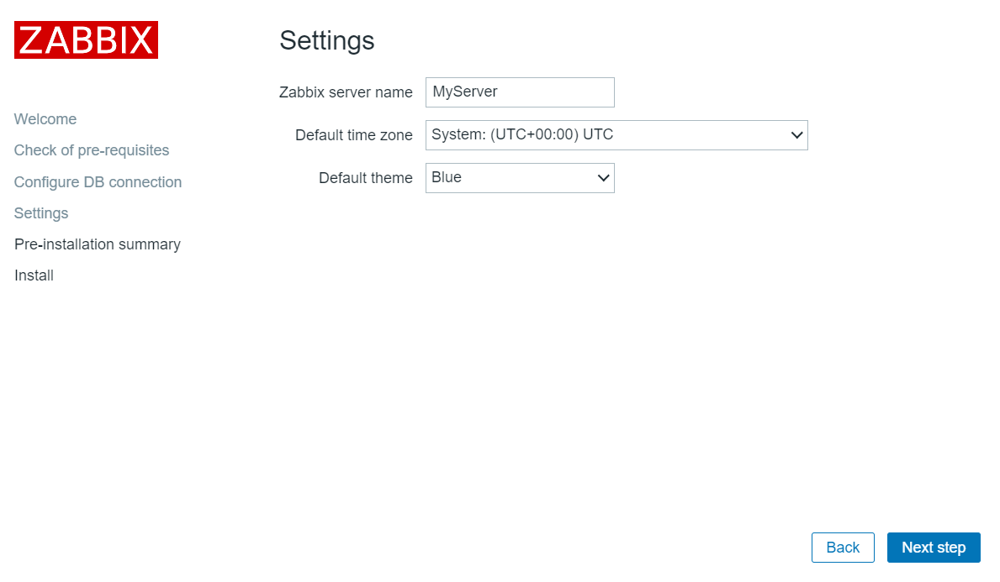
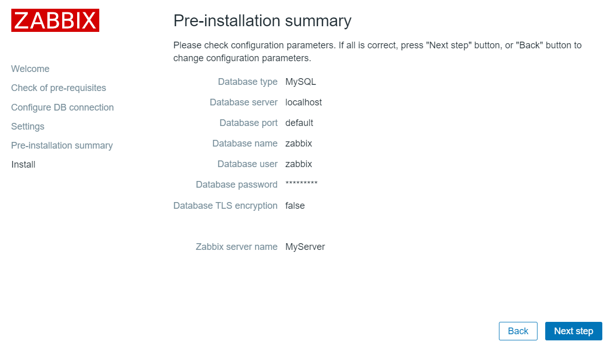
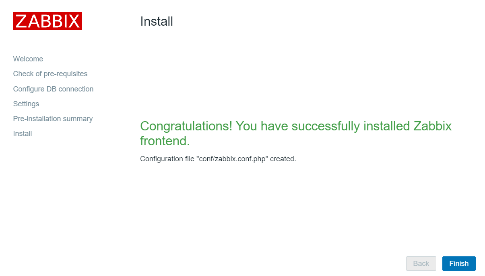
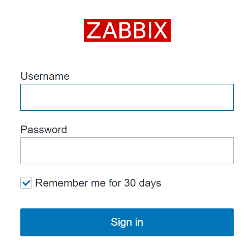

# Start using Zabbix

* Choose your language and go to the next step

* Check of pre-requisites and go to the next step

* Check of DB Configuration. Reenter password '**Pa$$word2**'. Go to the next step

* Type Zabbix server name as '**MyServer**'. Go to the next step

* Check Pre-installation summary. Go to the next step

* Click Finish Install

* You should get a Zabbix login page

 
