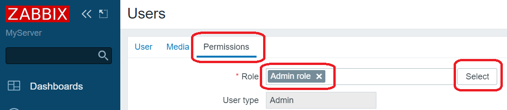
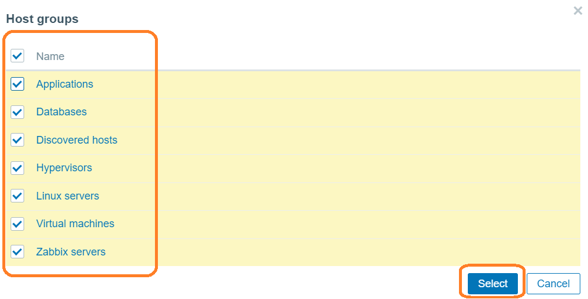
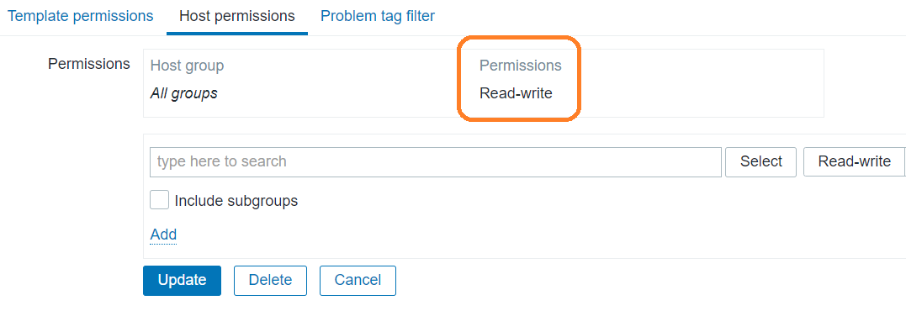
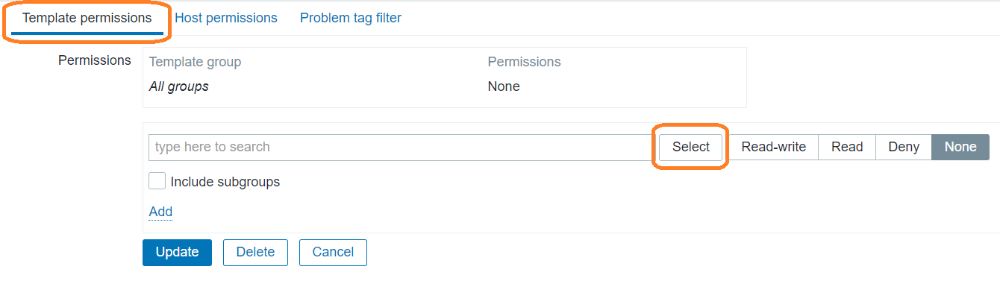
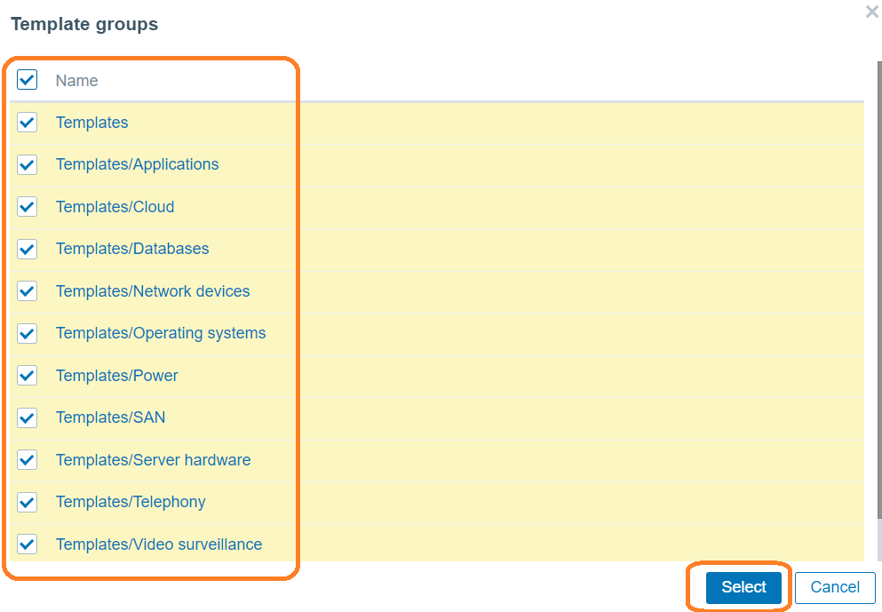
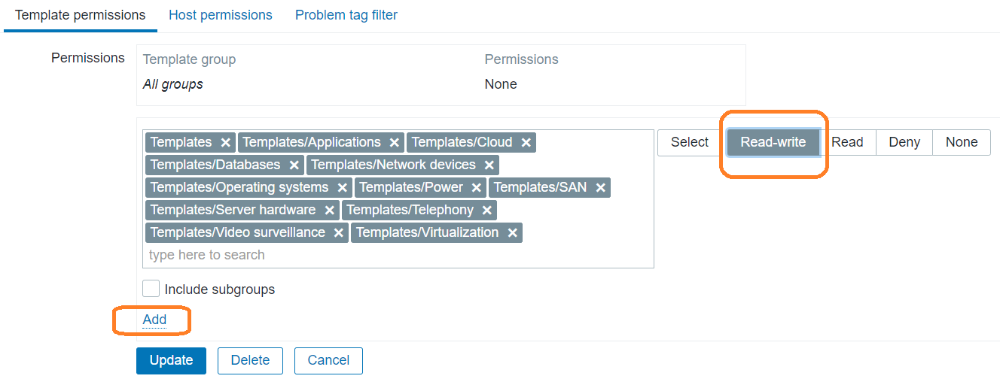
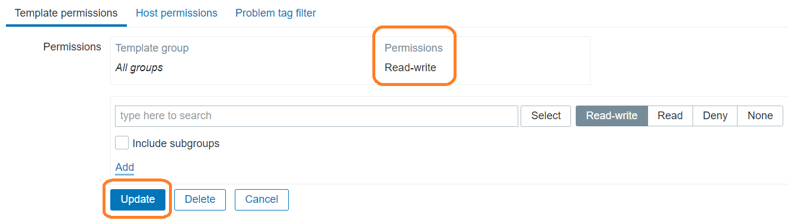
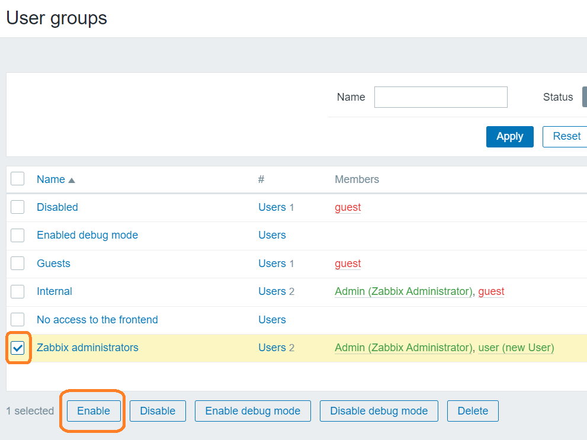

# Configuring Users

* Enter the user name "**Admin**" with password "**zabbix**" to log in as a Zabbix superuser.

Access to all menu sections will be granted.

> Media type information contains general instructions for using a medium as delivery channel for notifications.
  Specific details, such as the individual e-mail addresses to send a notification to are kept with individual users.

> In the "Alerts"/"Media types" section you can configure and maintain media type information.
  A listing of existing media types with their details is displayed.

* Double-click at the word "Disable", for example, in the email line

> You can configure and enable "media type" click on the "media type" link.

* If you want to configure a new media type, click on the Create media type button in the top right-hand corner (**not now**).

* To view information about users, go to Users/Users.

* To add a new user, click on the "Create user" button.

* Type new Username, Name, Last name.

* Set the password 'Pa$$word3' for the New user

* To add a group, click on "Select"

* In the new user form, make sure to add your user to one of the existing user groups, for example 'Zabbix administrators'.

> All mandatory input fields are marked with a red asterisk.

* By default, new users have no media (notification delivery methods) defined for them.

* To create one, go to the 'Media' tab and click on Add.

> You can specify a time period when the medium will be active, by default a medium is always active.
  You can also customize trigger severity levels for which the medium will be active.

* Click on "Add" button to save the medium. You can see next form.

* And then go to the Permissions tab. Click "Select" Button

> Permissions tab has a mandatory field Role.
  The role determines which frontend elements the user can view and which actions he is allowed to perform.

* Select one of the roles from the list and press Select button.

> For this example, select Admin role to allow access to all Zabbix frontend sections, except Administration.

* You have been granted the administrator role. You can see next form.

> Later on, you can modify permissions or create more user roles.
  Upon selecting a role, permissions will appear in the same tab.

* Adding permissions

* Click the "Add" button to finish creating a new user

* By default, a new user has no permissions to access hosts and templates.
  To grant the user to rights, click on the group of the user in the Groups column (for example, 'Zabbix administrators').

* In the group properties form, go to the "Host permissions" tab to assign permissions of host groups.

* Click the "Select" button to open the "Host Templates" window

* Please check all the boxes and then click the "Select" button.

* Click the 'Read-write' button to set the permission level and then "Add" to add the group to the list of permissions.

* You should get the following form.

* Please, go to the "Template permissions" tab to assign permissions of template groups and click "Select" button.

* Please check all the boxes and then click the "Select" button.

* Click the 'Read-write' button to set the permission level and then "Add" to add the group to the list of permissions.

* In the "User groups" properties form you should get the following form. Click Update button to make changes.

* Click "User groups" in the left control panel, check the box next to "Zabbix administrators" and then click "Select" to enable group.

Click "Next" to configure hosts and template groups.

 
