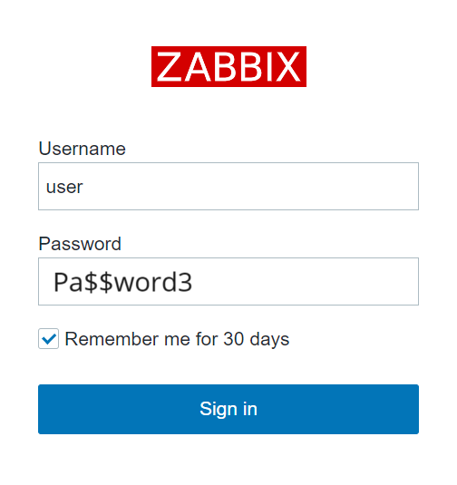
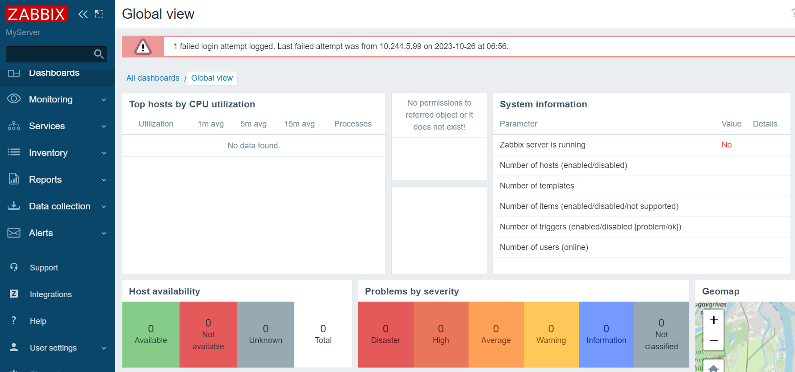

# Sign In as a new user

* Enter the user name "**user**" with password "**Pa$$word3**" to log in as a Zabbix superuser.

* You are logged in to the Zabbix server as a new user

> In Zabbix, access rights to hosts and templates are assigned to user groups, not individual users.

> To grant permissions to templates, you will need to switch to the Template permissions tab and specify template groups.

 
