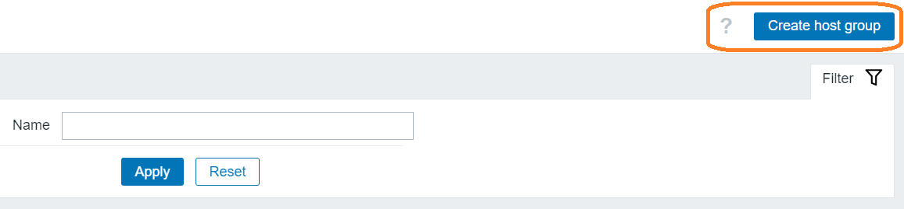
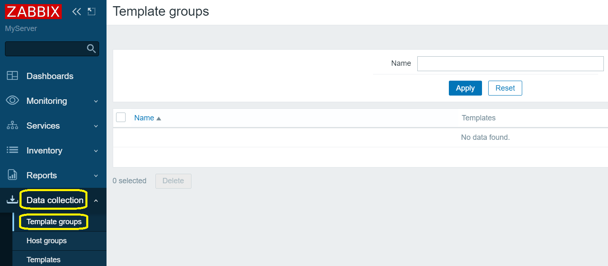
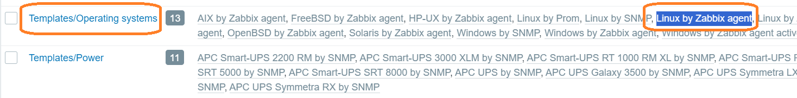
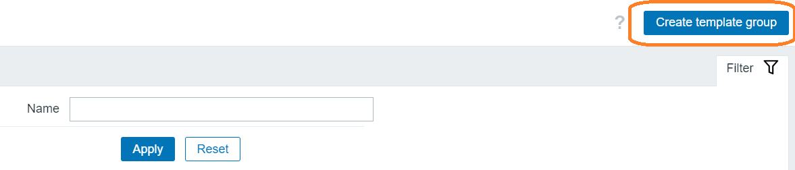

# Configuring Zabbix Server

> In this section, you will configure/enable host and templates groups.

* For first, click "Data collection", then "Hosts groups" in the left control panel.

* Select the checkboxes for all host groups and click the "Enable" button.

* You can create a new host group. Click the Create New Host Group button in the upper right corner (***not now***).

* Сlick "Template groups" button in the left control panel.

* Please, check the presence of the "Templates/Operating systems" template with "Linux by Zabbix agent" option.

* You can create a "Create Template Group" by clicking the button in the upper right corner (**not now**).

* Sign out of the super administrator account

* You may try to log in using the credentials of the new user.

 
