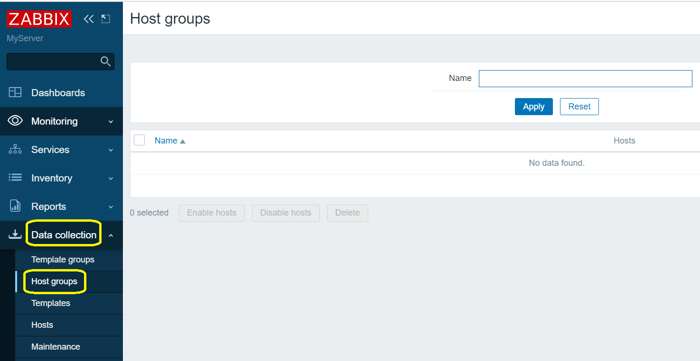
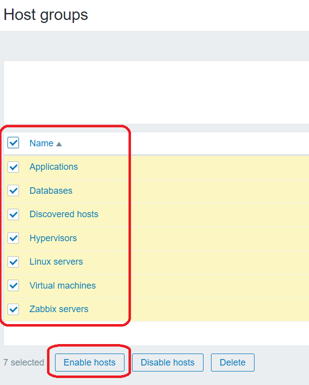
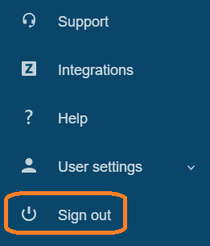
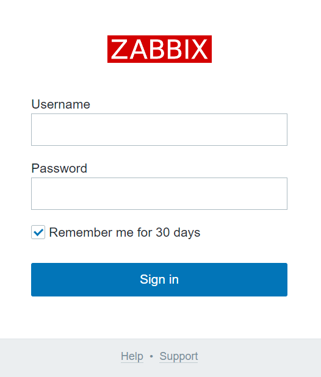

# Configuring Zabbix Server

> In this section, you will configure host and templates groups.

> Please enable Host and Template groups.

* For first, click "Data collection", then "Hosts groups" in the left control panel.

* Select the checkboxes for all host groups and click the "Enable" button.

* You can create a new host group. Click the Create New Host Group button in the upper right corner (***not now***).

* Сlick "Template groups" button in the left control panel.

* Click on the "Create new Template group" button in the top right-hand corner.

* Sign out of the super administrator account

* You may try to log in using the credentials of the new user.

 
