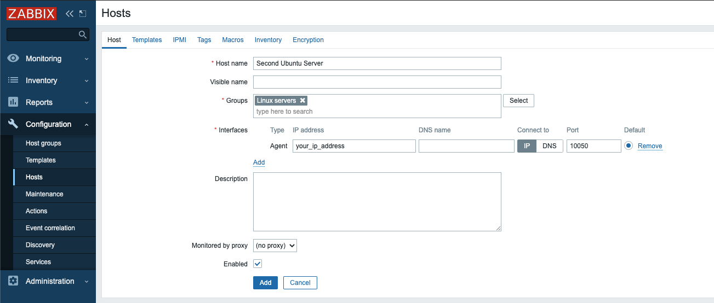
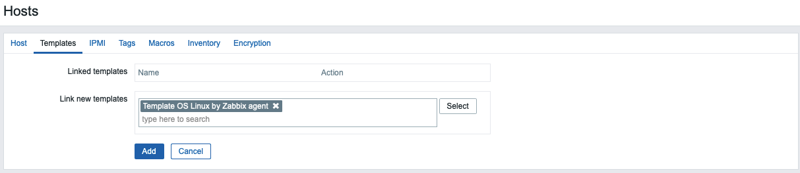
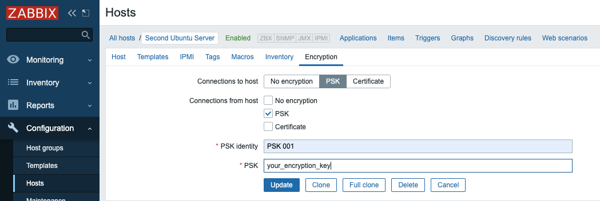
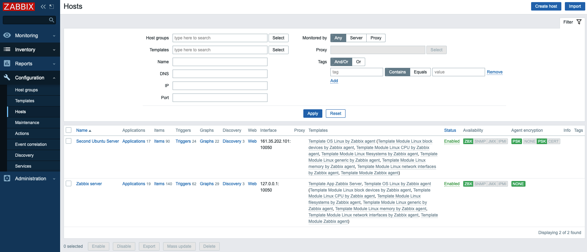
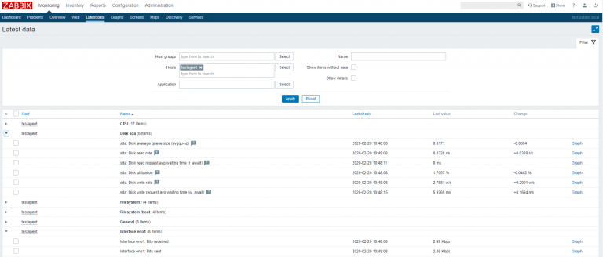

# Adding a new host to the Zabbix server

> Installing the agent on the host is half of the process. Each host you want to monitor must be registered on the Zabbix server.

* After sign in, click "Configuration", then "Hosts" in the left control panel. Then click the Create host button in the upper right corner of the screen.

* Create a Hostname and IP address, and then add the host to the group.

> You can select an existing group, such as Linux servers. A host can be in several groups. Enter the name of an existing or new group in the Groups field and select a value from the list.

* Before adding a group, click the Templates tab.

> Enter Template OS Linux by Zabbix agent​​ in the search field​​ and then select it from the list to add this template to the host.
There are many ready-made templates. Get to know them and choose the one that meets your requirements.

* Then go to the Encryption tab. Select No Encryption for Host Connections (Incoming Host Connections) and Host Connections​​ (Outgoing Host Connections)

Click the "Add" button at the bottom of the form to create a host.

* You will see the new host listed.

> Wait a minute and reload the page.

* Check whether the data from the agent appeared on the Zabbix server.

 
