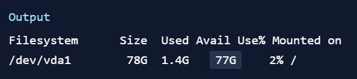
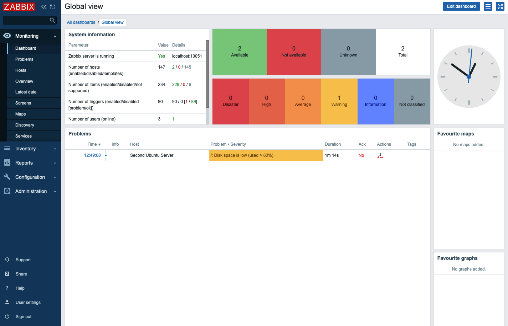

# Monitoring free space


> Zabbix can monitor the amount of free disk space. Create a temporary file so that it is large enough to trigger a file system usage message

* Determine, how much free space is available.
```
df -h
```{{exec}}

* The df command will report disk space usage on your filesystem, and -h will provide readable output. The result will look something like this:



In this case, the free space is 77G.


* Use the **fallocate** command, which allows you to create a file that takes up more than 80% of the available disk space```
fallocate -l 70G /tmp/temp.img
```{{exec}}

Zabbix activates a warning about the amount of free space on the disk

* You can go to Monitoring tab and then Dashboard to see description and details



* Delete the created temporary file to free up disk space
```
rm -f /tmp/temp.img
```{{exec}}


> Save the result of your work in the tracking system.

<br/>
