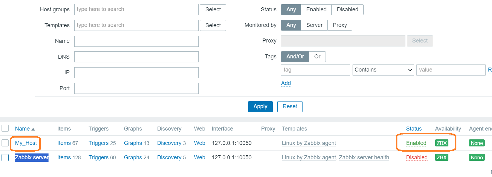

# Adding a new host to the Zabbix server

> Installing the agent on the host is half of the process. Each host you want to monitor must be registered on the Zabbix server.

* After sign in, click "Data collection", then "Hosts" in the left control panel.

* Then click the "Create host" button in the upper right corner of the screen.

This will present us with a host configuration form.

> Create a Hostname and IP address, and then add the host to the group.

* Add Hostname, for example, "My_Host"

* Click on the link "add" below "Interfaces" and select an agent.

* Leave the local address 127.0.0.1 and port 10050 for this example.

* Select one or several existing groups by clicking "Select" button.

* Check the box next to "Linux servers" and "Zabbix servers" and then click "Select" button.

* A host can be in several groups.

* Before adding a group, click "Select" button next to the "Templates".

* In the search field, type "Templates/" on select "Templates/Operating system".

> There are many ready-made templates. Get to know them and choose the one that meets your requirements.

Please check the box next to "Linux by Zabbix Agent" from the drop-down list and press "Select" button.

* You should get the following form.

* Then go to the "Encryption" tab. Select "No Encryption" for Host Connections (Incoming Host Connections) and Host Connections​​ (Outgoing Host Connections).

* Click the "Add" button at the bottom of the form to create a host.

* To avoid a conflict, disable the "Zabbix server". Check the box next to "Zabbix server" and click "Disable" button

* You will see the new host listed.

 - host is available, a metric check has been successful.

> Wait a minute and reload the page.

* Click "Monitoring" and then "Hosts" in the left control panel.

* Click on the host name "My_Host" and select from the context menu "Latest data"

* Check whether the data from the agent appeared on the Zabbix server.

 
