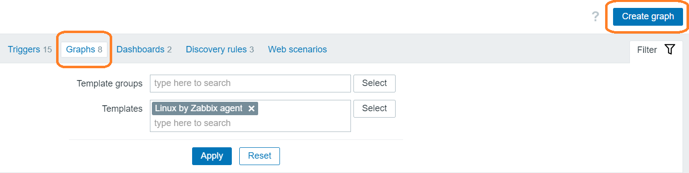
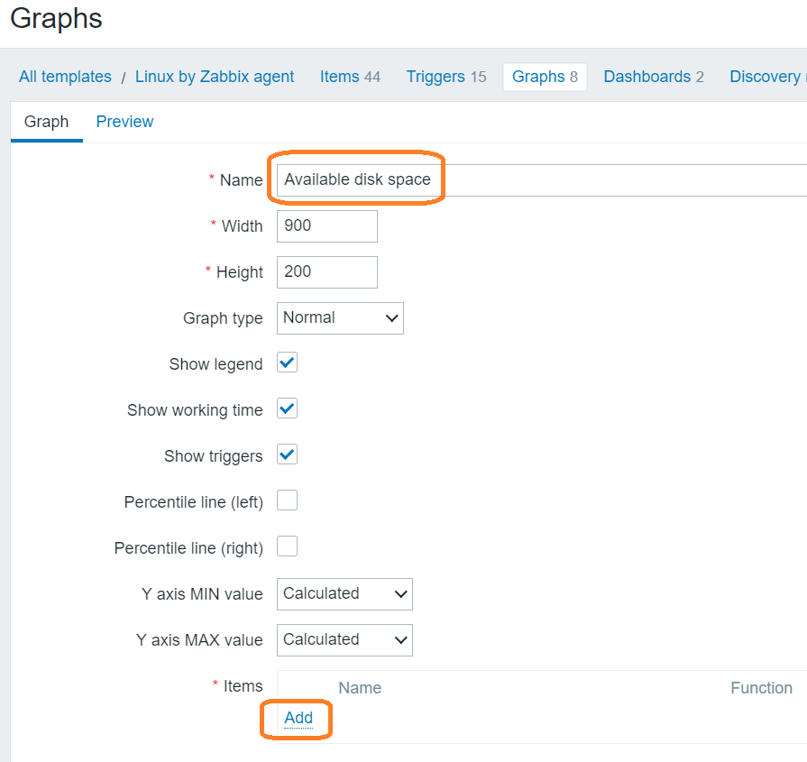
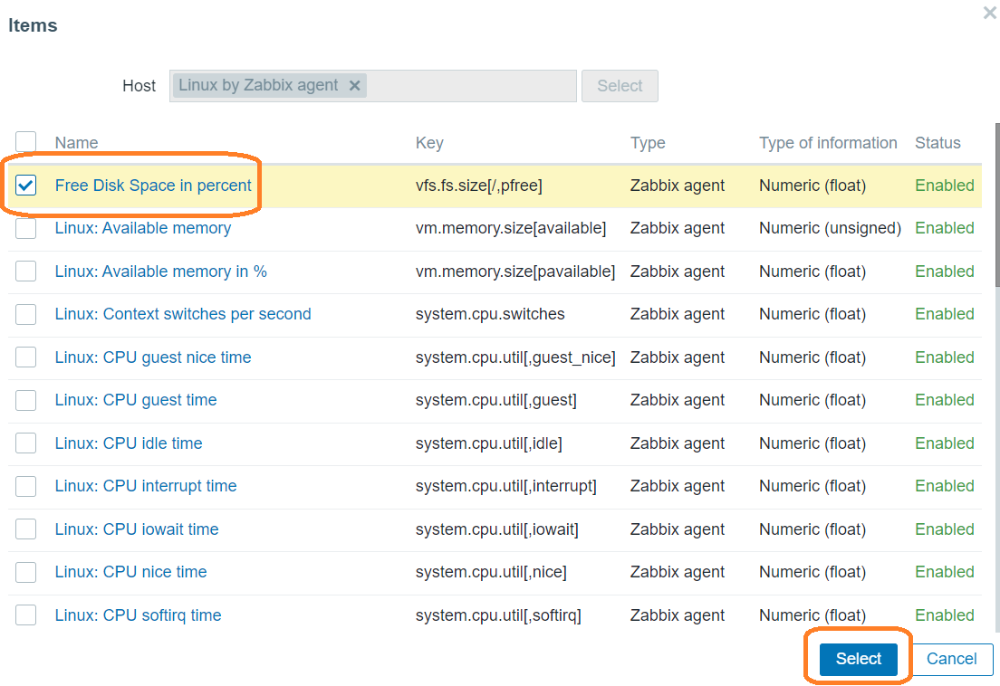
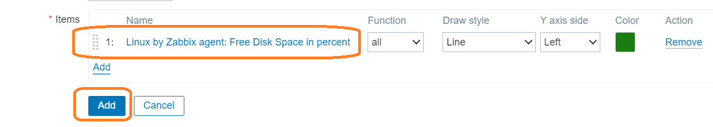
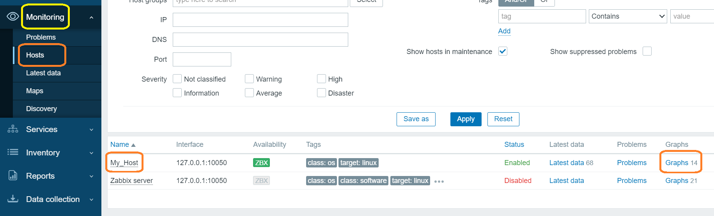
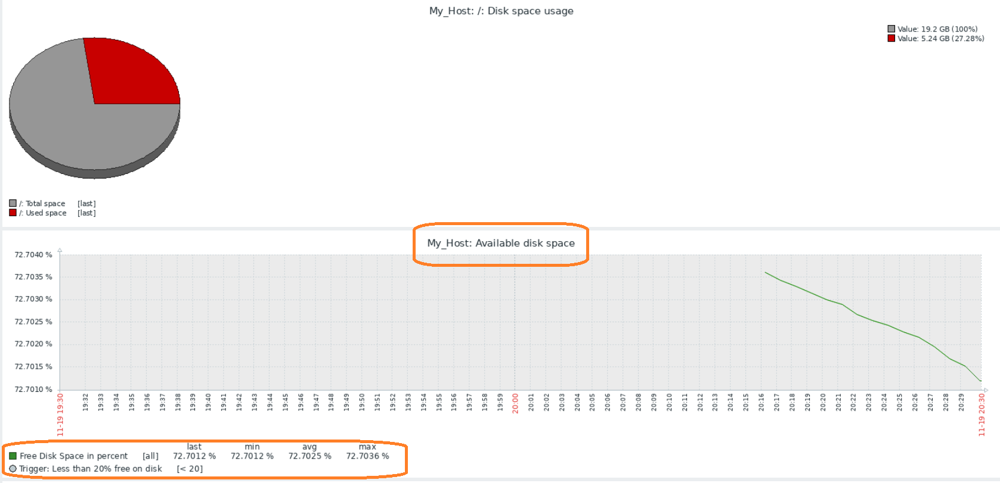
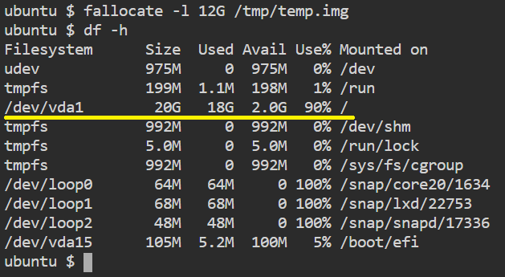
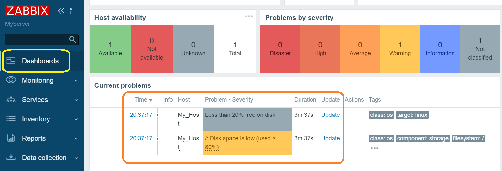
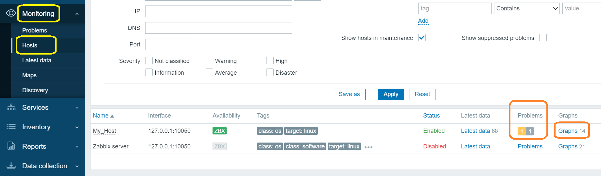
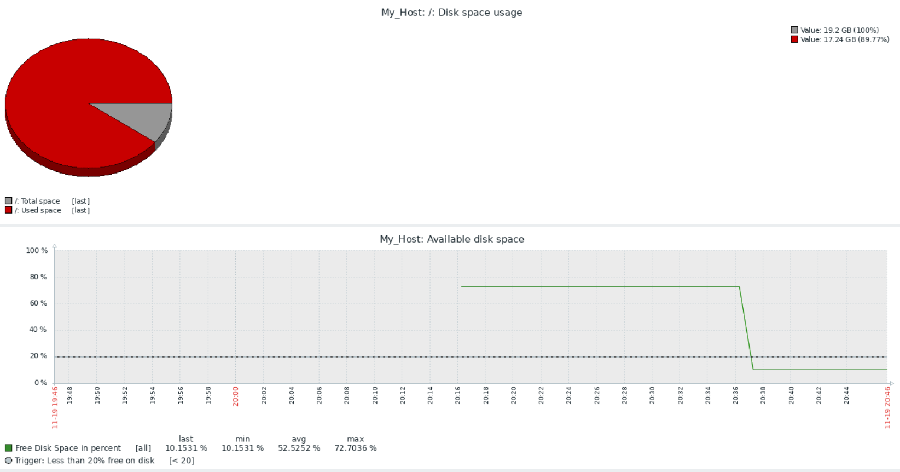

# Monitoring disk space


> Zabbix monitor the amount of free disk space. Create a temporary file so that it is large enough to trigger a file system usage message.

* Consider the template "Linux by Zabbix agent". Please, Click "Data collection", then "Templates" in the left control panel.


* Find the "Linux by Zabbix agent" template in the list and click on it.


* You will receive the following form.


* Сreate a new item in the template. Click on the tab "Items" and on the "Create item" button in the upper right corner.


* Add a new item name "Free Disk Space in percent", Type of information "Numeric (float)", Units "%", Update interval 1m, Key **vfs.fs.size[/,pfree]**


* Click "Add" button to save.


* Let's create a trigger, if there is less than 20% free disk space. Go to the "Triggers" tab and click on the "Create trigger" button in the upper right corner.


* Add a new trigger name "Less than 20% free on disk", check the box "Allow manual close", Expression **last(/My_Host/vfs.fs.size[/,pfree])<20** and click "Add" button to save.


* Let's create a graph to display free disk space. Go to the "Graphs" tab and click on the "Create graph" button in the upper right corner.



* Add graph name "Available disk space" and attach the "Free Disk Space in percent" item by clicking the "Add" link.



* Select the "Free Disk Space in percent" item , click "Select" Button to close popup.



* Click the "Add" button to create a new graph.



* Click "Monitoring" and then "Hosts" in the left control panel.


* Click on the "Graphs" link in the "My_Host" row.



* We can watch the change of free space on the disk in real time in percentage.



> The operation of the trigger is displayed in the lower left corner.

* Determine, how much free space is available.
```
df -h
```{{exec}}

* The df command will report disk space usage on your filesystem, and -h will provide readable output. The result will look something like this:


In this case, the free space is 14G.

* Use the **fallocate** command, which allows you to create a file that takes up more than 80% of the available disk space```
```
fallocate -l 12G /tmp/temp.img
```{{exec}}

* We have taken more than 80% of the disk space



Zabbix activates a warning about the amount of free space on the disk.

* You can go to "Dashboards" to see description and details



* Click "Monitoring", then "Hosts" in the left control panel.



* You can see the graph by clicking on the link in the host line.



* Delete the created temporary file to free up disk space
```
rm -f /tmp/temp.img
```{{exec}}


> Save the result of your work in the tracking system.

<br/>
